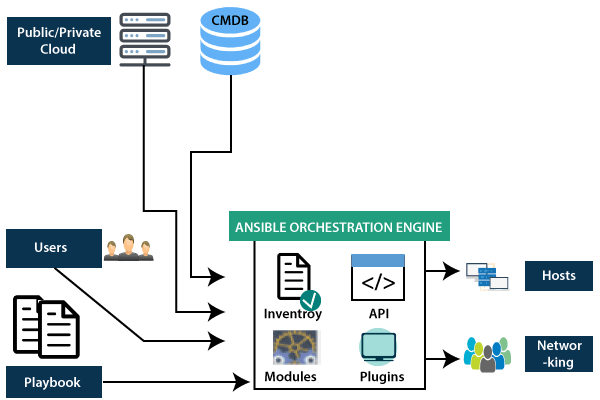

14 Sept 2024
---------------------------------------------
Agile Framework:-
    1. To deliver the efficient Modules in time
    2. Enchances Collaboration and Adabtability

Scrum FrameWork:-
    1. On priority (Sprint) time period.
    2. Sprint review
    3. Retrospective process
    4. Rigid framework because it is time bound

Canwan FrameWork:-
    1. There is not time limit in this ie there is no sprint here  
    2. It depends on the time that you take to complete the time  
    3. It is Flexible framework because we are not bounded by time  
    4. It focuses on efficiency of work rather than the time  


19 Sept 2024 - Sandhya mam
-----------------------------------------------------------------------------
# CI/CD Pipeline:- Contineous Integration and Contineous Delivery/Deployment
    
    VCS: Tracks changes and enhances collaboration like github and git
        when we commit our project to git and pipeline formed (CD Pipeline started)


Topics for exams
-----------------------------
Unit 1 (Every topic) - ISE
defination and histroy of devops
importance of devops
agile develpoment framework

lecture 1 2 3 full 


20 Sept 2024 - Sandhya Mam
--------------------------------------------------------------------------------------------
# Creating, Testing, Deployment

CI Prelims - 
            Version Control System
            Virtual Machine
            Hosted CI Tools
            CI Tools


Cotineous Deployment - 

IAC (Infrastructure as Code) - 
                            Server Provisioning - How many server are needed for our System as per requirements
                                
---

# 9 November - Ashad Sir

## Topic -`Kubernetes` - `Used to Manage and Track Containers`

- we can install it in command line and then use it
- It guides multiple containers

---

# Containers

A **container**  is a lightweight, standalone unit that packages an application and its dependencies (libraries, binaries, configuration files) together, ensuring that it runs consistently across different computing environments.
### Why Do We Need Containers? 
 
1. **Consistency Across Environments** :
  - Containers ensure that an application behaves the same way in development, testing, and production environments because it includes everything needed to run the app.
 
2. **Isolation** :
  - Each container runs in its own isolated environment, avoiding conflicts between applications (e.g., different versions of the same library).
 
3. **Efficiency** :
  - Containers share the host operating system's kernel, making them faster and more efficient than virtual machines (VMs) because they use fewer system resources.
 
4. **Portability** :
  - Containers can run on any platform that supports container runtimes (e.g., Docker), making it easy to move applications between cloud providers or local systems.
 
5. **Scalability** :
  - Containers can be quickly started or stopped, allowing applications to scale up or down based on demand.

### Examples of Containers: 
 
1. **Docker** : The most common container platform, used for packaging and running applications.
  - Example: A web application containerized with Nginx for the web server and Node.js for the backend logic.
 
2. **Apache HTTP Server Container** :
  - Runs the Apache server inside a container to serve static or dynamic content without needing to configure the host system.
 
3. **MySQL Container** :
  - Provides a containerized version of the MySQL database, allowing developers to easily run and manage a database without complex setup.
In summary, containers solve the problem of **"it works on my machine"**  by providing a consistent environment everywhere they run.


# Kubernetes

**Kubernetes**  is an open-source platform for automating the deployment, scaling, and management of containerized applications. It helps you run and manage applications across multiple servers by organizing them into units called *pods*.
### Examples of Kubernetes Use: 
 
1. **Auto-scaling a Web App**: When user traffic increases on a web application, Kubernetes automatically creates more instances of the app to handle the load.
 
2. **Rolling Updates**: It allows seamless updates of applications without downtime by rolling out new versions while keeping the old ones running until the new ones are ready.
 
3. **Load Balancing**: If you have multiple instances of an app running, Kubernetes distributes user requests evenly among them to prevent any single instance from being overwhelmed.


`Why do we need Kubernetes`:

We need **Kubernetes**  to efficiently manage and scale applications in a containerized environment. It solves the complexity of deploying, scaling, and maintaining container-based applications across a cluster of machines.
### Key Roles of Kubernetes: 
 
1. **Container Orchestration** :
  - Manages the deployment of containers across multiple machines.

  - Ensures containers are running as expected and restarts them if they fail.
 
2. **Scalability** :
  - Automatically scales the number of containers up or down based on the application’s demand (e.g., more traffic = more instances).
 
3. **Load Balancing** :
  - Distributes traffic evenly across multiple container instances to ensure no single instance is overwhelmed.
 
4. **Self-Healing** :
  - Detects failed containers and replaces them automatically without user intervention.
 
5. **Rolling Updates and Rollbacks** :
  - Updates applications seamlessly without downtime and can roll back to a previous version if there are issues.

### Why Use Kubernetes? 

Without Kubernetes, managing containers manually across multiple servers can become complex and error-prone. Kubernetes automates these tasks, making it easier to deploy, scale, and maintain applications reliably in production environments.


---


# 2nd Insem


### 1. **Introduction to DevOps**
- **What is DevOps?**
  - DevOps is a set of practices that combines software development (Dev) and IT operations (Ops) to automate and integrate the processes of software development and deployment.
- **Benefits of DevOps:**
  - Faster software delivery, improved collaboration, better quality, and reduced time to market.
- **Real-life Example:**
  - Netflix uses DevOps practices to ensure continuous delivery of content updates and features without downtime.

### 2. **Git and GitHub**
- **What is Git?**
  - Git is a version control system that tracks changes in source code during software development.
- **What is GitHub?**
  - GitHub is a cloud-based platform that hosts Git repositories and facilitates collaboration among developers.
- **Git vs GitHub:**
  - **Git:** Local tool for version control.
  - **GitHub:** Cloud-based service for hosting and sharing Git repositories.
- **Real-life Example:**
  - Developers use GitHub to collaborate on open-source projects like React and TensorFlow.

### 3. **Docker**
- **Introduction to Docker:**
  - Docker is a containerization platform that packages applications and their dependencies into isolated containers.
- **Docker Architecture:**
  - **Components:**
    - **Docker Client:** Interface for users to interact with Docker.
    - **Docker Engine:** Runs and manages containers.
    - **Docker Hub:** Centralized repository for Docker images.
- **Docker Desktop and Docker Hub:**
  - **Docker Desktop:** Local tool for building and running containers.
  - **Docker Hub:** Online repository for sharing and storing Docker images.
- **DockerHub: Working Process:**
  - Users can upload images to DockerHub for public or private use, making them easily accessible for deployment.
- **Downloading Images through DockerHub or CLI:**
  ```bash
  docker pull nginx
  ```
- **Real-life Example:**
  - Spotify uses Docker to manage microservices, allowing faster deployments and better resource utilization.

### 4. **Kubernetes**
- **What is Kubernetes?**
  - Kubernetes is an open-source platform for automating the deployment, scaling, and management of containerized applications.
- **Kubernetes vs. Jenkins:**
  - **Kubernetes:** Manages containerized applications.
  - **Jenkins:** Automates the CI/CD pipeline.
- **Real-life Example:**
  - Google uses Kubernetes to manage its cloud services and scale workloads efficiently.

### 5. **Jenkins**
- **What is Jenkins?**
  - Jenkins is an open-source automation server used to automate the CI/CD pipeline.
- **Jenkins in Continuous Integration (CI):**
  - Jenkins automates the process of building, testing, and deploying code, ensuring faster feedback loops.
- **Working Process of Jenkins:**
  1. Code is pushed to a repository.
  2. Jenkins pulls the code, builds it, runs tests, and deploys it if tests pass.
- **Real-life Example:**
  - LinkedIn uses Jenkins to automate testing and deployments, reducing manual effort.

### 6. **Cloud Services**
- **Introduction to Cloud Services:**
  - Cloud services provide on-demand computing resources over the internet.
- **Types of Cloud Services:**
  - **IaaS (Infrastructure as a Service):**
    - Provides virtualized computing resources.
    - **Example:** AWS EC2
  - **SaaS (Software as a Service):**
    - Delivers software over the internet.
    - **Example:** Google Workspace
  - **PaaS (Platform as a Service):**
    - Provides a platform for building, testing, and deploying applications.
    - **Example:** Heroku
- **Real-life Example:**
  - Startups use AWS (IaaS) for scalable infrastructure, Salesforce (SaaS) for CRM, and Azure App Service (PaaS) for hosting web apps.

### 7. **Infrastructure as Code (IaC)**
- **What is Terraform?**
  - Terraform is an open-source tool for defining and provisioning infrastructure using code.
- **Terraform for Infrastructure Support:**
  - Uses configuration files to manage infrastructure like servers, databases, and networking.
- **Real-life Example:**
  - Uber uses Terraform to automate cloud infrastructure across multiple providers.

### 8. **Server-Oriented Architecture**
- **What is Server-Oriented Architecture?**
  - A traditional architecture where applications run on dedicated servers. Scaling is done by adding more servers.
- **Real-life Example:**
  - Legacy banking systems often use server-oriented architecture, relying on mainframe servers.

### 9. **Automation Tools**
- **What is Puppet?**
  - Puppet is a configuration management tool used to automate server setup, configuration, and management.
- **Puppet for Automation Management:**
  - Uses "manifests" (scripts) to define the desired state of infrastructure, ensuring consistency across environments.
- **Real-life Example:**
  - Spotify uses Puppet to automate the configuration of its servers, reducing manual effort and errors.

---

## Detailed Explanation

A **detailed explanation** of all the formatted topics with comprehensive information, examples, and how each fits into a real-world DevOps and cloud setup.

---

### 1. **DevOps: An Introduction**
- **Definition:**
  - DevOps is a set of practices that combines software development (Dev) and IT operations (Ops). The goal is to shorten the software development lifecycle and deliver features, fixes, and updates frequently in close alignment with business objectives.
- **Key Principles:**
  - **Continuous Integration (CI):** Regularly integrating code changes into a shared repository.
  - **Continuous Delivery (CD):** Automating the release process so code changes are ready for deployment at any time.
  - **Automation:** Using tools to automate repetitive tasks like testing, deployment, and infrastructure management.
  - **Collaboration:** Improved communication between development, testing, and operations teams.
- **Real-life Example:**
  - At Facebook, DevOps practices ensure the platform is updated several times a day without downtime.

### 2. **Git and GitHub**
- **Git:**
  - Git is a distributed version control system that allows developers to track changes in code, collaborate on projects, and manage different versions of their software.
- **GitHub:**
  - GitHub is a cloud-based platform that hosts Git repositories, enabling developers to collaborate on projects, perform code reviews, and manage releases.
- **Key Concepts:**
  - **Repository:** A storage location for your code.
  - **Branch:** A separate version of the repository, used for developing features.
  - **Commit:** A snapshot of code changes.
  - **Pull Request:** A request to merge changes from one branch to another.
- **Example Workflow:**
  1. Developer creates a branch for a new feature.
  2. Code is pushed to GitHub.
  3. Team members review the changes via a pull request before merging it into the main branch.
- **Real-life Example:**
  - The development team at Microsoft uses GitHub to collaborate on open-source projects like Visual Studio Code.

### 3. **Docker and Its Architecture**
- **What is Docker?**
  - Docker is a platform for developing, shipping, and running applications inside **containers**. Containers are lightweight, standalone, and executable packages that include everything needed to run an application.
- **Docker Architecture:**
  - **Docker Client:** Interface that sends commands to the Docker Engine.
  - **Docker Engine:** The core part of Docker that builds, runs, and manages containers.
  - **Docker Daemon:** Runs on the host machine and listens for Docker API requests.
  - **Docker Images:** Read-only templates used to create containers.
  - **Docker Containers:** Instances of Docker images running as isolated processes.
  - **Docker Hub:** A cloud-based repository for storing and sharing Docker images.
- **Benefits:**
  - Portability, environment consistency, and resource efficiency.
- **Real-life Example:**
  - PayPal uses Docker to run thousands of microservices, ensuring consistent deployments across environments.

### 4. **Docker Desktop and Docker Hub**
- **Docker Desktop:**
  - A local application that provides an easy-to-use interface for managing Docker containers on a developer’s workstation. It includes Docker Engine, Docker CLI, and Docker Compose.
- **Docker Hub:**
  - A cloud-based registry where Docker images are stored and shared.
- **Key Commands:**
  ```bash
  docker pull nginx           # Download an image
  docker run -d nginx         # Run a container
  docker push myimage:tag     # Push an image to Docker Hub
  ```
- **Real-life Example:**
  - The development team at Airbnb uses Docker Desktop for local development and testing before pushing images to Docker Hub for deployment.

### 5. **Jenkins and Its Working Process**
- **What is Jenkins?**
  - Jenkins is an open-source automation server used for **continuous integration (CI)** and **continuous delivery (CD)**. It helps automate parts of the software development process such as building, testing, and deploying code.
- **Key Features:**
  - **Pipeline as Code:** Define build and release pipelines using code.
  - **Plugins:** Over 1,000 plugins for integrating with other tools (e.g., GitHub, Docker).
- **Jenkins Workflow:**
  1. Developer pushes code to GitHub.
  2. Jenkins detects the code change, triggers a build, runs automated tests, and deploys if tests pass.
  3. Feedback is provided to the developer.
- **Real-life Example:**
  - LinkedIn uses Jenkins to automate testing and deployment, reducing time to release new features.

### 6. **Kubernetes: Container Orchestration**
- **What is Kubernetes?**
  - Kubernetes is an open-source platform for automating the deployment, scaling, and management of containerized applications.
- **Components:**
  - **Node:** A machine (virtual or physical) running Kubernetes.
  - **Pod:** The smallest deployable unit, consisting of one or more containers.
  - **Service:** Defines a logical set of pods and a policy for accessing them.
  - **Ingress:** Manages external access to services.
- **Benefits:**
  - Scalability, self-healing, load balancing, and service discovery.
- **Real-life Example:**
  - Google Cloud uses Kubernetes to manage its massive infrastructure and services like Gmail and Google Search.

### 7. **Cloud Services (IaaS, PaaS, SaaS)**
- **IaaS (Infrastructure as a Service):**
  - Provides virtualized computing resources over the internet (e.g., AWS EC2).
- **PaaS (Platform as a Service):**
  - Provides a platform for building, testing, and deploying applications without managing underlying infrastructure (e.g., Google App Engine).
- **SaaS (Software as a Service):**
  - Delivers software applications over the internet (e.g., Microsoft 365).
- **Real-life Example:**
  - Netflix uses AWS (IaaS) for its infrastructure, Heroku (PaaS) for backend services, and Salesforce (SaaS) for CRM.

### 8. **Terraform: Infrastructure as Code (IaC)**
- **What is Terraform?**
  - Terraform is an open-source tool for building, changing, and versioning infrastructure using code.
- **Key Features:**
  - **Declarative Configuration:** Describe the desired state of infrastructure.
  - **Provider Support:** Works with AWS, Azure, GCP, and other services.
- **Example Usage:**
  ```hcl
  provider "aws" {
    region = "us-west-2"
  }

  resource "aws_instance" "web" {
    ami           = "ami-0c55b159cbfafe1f0"
    instance_type = "t2.micro"
  }
  ```
- **Real-life Example:**
  - Spotify uses Terraform to manage cloud resources across AWS and Google Cloud.

### 9. **Server-Oriented Architecture**
- **Definition:**
  - A traditional architecture model where applications run on dedicated physical or virtual servers.
- **Benefits:**
  - Simplicity and control over hardware resources.
- **Drawbacks:**
  - Limited scalability and flexibility compared to microservices and serverless architectures.
- **Real-life Example:**
  - Legacy banking systems often use server-oriented architecture for core banking applications.

### 10. **Puppet: Automation and Configuration Management**
- **What is Puppet?**
  - Puppet is an open-source configuration management tool that automates the process of configuring and maintaining servers.
- **How It Works:**
  - Uses "manifests" (scripts) to define the desired state of the infrastructure.
- **Key Components:**
  - **Puppet Master:** Manages the configuration of nodes.
  - **Puppet Agent:** Runs on nodes to apply configurations.
- **Real-life Example:**
  - NASA uses Puppet to automate the configuration of its servers, reducing manual errors.

---


# Real Life Scenerios

Let's consider a real-life analogy of building and launching an **online e-commerce platform** (like Amazon or Flipkart). In this scenario, we'll see how each DevOps and cloud technology/tool plays an essential role in different stages of development, deployment, and maintenance.

### **Scenario: Launching an E-commerce Platform**

Your company, **ShopifyHub**, aims to launch a new e-commerce platform. You need a scalable, high-performing solution that can handle millions of users, provide a smooth user experience, and ensure continuous updates without downtime. Let's see how DevOps tools, cloud services, and automation play a part in making this happen.

#### **1. Git and GitHub: Code Version Control and Collaboration**
- **Problem:** Your development team needs a system to manage code changes, collaborate effectively, and track versions.
- **Solution:** Developers use **Git** for version control to manage changes in the source code. They push the code to a shared **GitHub** repository, where team members can review, merge, and track code changes.
- **Real-life Role:** The development team creates branches for features like payment integration and product catalog. GitHub is used to handle pull requests and code reviews, ensuring high code quality.

#### **2. Docker: Containerization for Environment Consistency**
- **Problem:** Your app works on the developer's local machine but has compatibility issues when deployed on different environments (staging, testing, and production).
- **Solution:** Use **Docker** to package the application and its dependencies into a container, ensuring it runs the same everywhere.
- **Real-life Role:** The development team creates Docker images for the frontend (React), backend (Node.js), and database (MySQL). These images are pushed to **DockerHub**, allowing the QA team and DevOps team to easily pull the images for testing and deployment.

#### **3. DockerHub: Image Repository**
- **Problem:** You need a centralized place to store and distribute Docker images.
- **Solution:** Use **DockerHub** as an image repository where you upload and manage your Docker images.
- **Real-life Role:** The DevOps team pushes the latest Docker images to DockerHub. During deployment, images are pulled from DockerHub using the CLI with a simple command:
  ```bash
  docker pull shopifyhub/backend:latest
  ```

#### **4. Jenkins: Continuous Integration (CI) and Continuous Deployment (CD)**
- **Problem:** You want to automate the process of building, testing, and deploying code to ensure faster releases.
- **Solution:** Use **Jenkins** for automating the CI/CD pipeline.
- **Real-life Role:** Whenever a developer pushes code to GitHub, Jenkins automatically pulls the code, builds the Docker images, runs tests, and deploys the containers to the staging environment. This process is automated, reducing manual effort and speeding up the release cycle.

#### **5. Kubernetes: Container Orchestration and Scaling**
- **Problem:** You need to manage multiple containers (frontend, backend, database) efficiently and ensure the application scales based on traffic.
- **Solution:** Use **Kubernetes** to automate the deployment, scaling, and management of containerized applications.
- **Real-life Role:** Kubernetes is used to deploy Docker containers across a cluster of nodes. It handles load balancing, automatic scaling, and self-healing (restarting failed containers). During a flash sale, Kubernetes automatically scales the backend service to handle the increased traffic.

#### **6. Cloud Services (IaaS, PaaS, SaaS): Hosting and Infrastructure Management**
- **Problem:** You need a scalable and flexible infrastructure to host the e-commerce platform without managing physical servers.
- **Solution:** Use a mix of **IaaS**, **PaaS**, and **SaaS** cloud services.
- **Real-life Role:**
  - **IaaS (e.g., AWS EC2):** Provides virtual machines to host the Kubernetes cluster.
  - **PaaS (e.g., AWS Elastic Beanstalk):** Manages the backend services and abstracts away infrastructure management.
  - **SaaS (e.g., Stripe for Payments):** Integrates third-party software for payment processing.

#### **7. Terraform: Infrastructure as Code (IaC)**
- **Problem:** Manually provisioning cloud infrastructure is error-prone and time-consuming.
- **Solution:** Use **Terraform** to automate the setup of cloud resources using configuration files.
- **Real-life Role:** The DevOps team writes Terraform scripts to provision AWS resources like EC2 instances, S3 buckets, and VPCs. This ensures consistent, repeatable infrastructure setup across environments.

#### **8. Server-Oriented Architecture: Legacy Systems Integration**
- **Problem:** Your company has a legacy ERP system that needs to be integrated with the new e-commerce platform.
- **Solution:** Use a **Server-Oriented Architecture** to connect the legacy ERP system with the new microservices-based architecture.
- **Real-life Role:** The ERP system runs on a dedicated server, and APIs are used to connect it with the new platform for order processing and inventory management.

#### **9. Puppet: Automation and Configuration Management**
- **Problem:** Manually configuring servers for deployment is time-consuming and prone to errors.
- **Solution:** Use **Puppet** for configuration management to automate server setup and ensure consistency.
- **Real-life Role:** Puppet scripts (manifests) are used to automate the configuration of web servers, database servers, and load balancers, ensuring they are set up with the correct software versions and settings.

---

### **End-to-End Flow of the E-commerce Platform:**
1. **Development:** The team uses Git and GitHub for version control and collaboration.
2. **Build:** Docker is used to package the application into containers, which are then uploaded to DockerHub.
3. **Testing and Integration:** Jenkins pulls the latest code from GitHub, builds the Docker images, and runs automated tests.
4. **Infrastructure Setup:** Terraform provisions the required cloud infrastructure on AWS.
5. **Deployment:** Kubernetes deploys and manages the Docker containers across the cluster, ensuring scalability.
6. **Configuration Management:** Puppet ensures consistent server setup and configuration.
7. **Maintenance:** The platform uses cloud services (IaaS, PaaS, SaaS) to handle infrastructure needs, allowing the DevOps team to focus on scaling and updates.

---

### **Real-life Example: Amazon's E-commerce Platform**
- **Amazon** uses a similar setup with containerization (Docker), orchestration (Kubernetes), and automation (Jenkins, Puppet) to manage its large-scale infrastructure and handle peak traffic during events like Prime Day. They use GitHub for version control and Terraform for provisioning cloud infrastructure on AWS.

This comprehensive scenario illustrates how each tool and technology plays a vital role in developing, deploying, and maintaining a large-scale, high-traffic application.


`2nd Insem end here`

---


# End Sem

## Imp Topics

## **1. Docker**

Docker is an open-source platform designed to build, deploy, and run applications using containers. Containers are lightweight, portable, and isolated environments that include everything an application needs to run.


#### **History of Docker**
- **Founded in 2013**: Docker Inc. was created by Solomon Hykes and his team at DotCloud, originally a Platform-as-a-Service (PaaS) company.
- **Initial Release**: The first version of Docker (Docker 0.9) was released in March 2013, featuring containerization technology built on **Linux Containers (LXC)**.
- **Breakthrough in 2015**: Docker Engine was rewritten to use its own library, **libcontainer**, instead of LXC, making it independent of other container runtimes.
- **Docker Swarm**: Introduced as a native clustering and orchestration solution for Docker in 2015.
- **Industry Standard**: By 2017, Docker had become the de facto standard for containerization, with widespread adoption across cloud providers and development teams.


#### **Advantages of Docker**
`Peris df`
1. **Portability**:
   - Docker containers can run on any platform that supports Docker, ensuring consistent performance across environments (development, testing, and production).

2. **Resource Efficiency**:
   - Containers share the host operating system kernel, making them more lightweight compared to virtual machines (VMs), which require a full OS for each instance.

3. **Faster Deployment**:
   - Docker containers can start in seconds, improving development and deployment speeds.

4. **Isolation**:
   - Applications and their dependencies run in isolated containers, avoiding conflicts between software versions or libraries.

5. **Scalability**:
   - Docker simplifies scaling applications horizontally by running multiple container instances.

6. **DevOps Integration**:
   - Integrates seamlessly into CI/CD pipelines, enabling automation of application building, testing, and deployment.

7. **Ecosystem**:
   - Docker Hub provides a vast library of pre-built container images.

---

#### **Disadvantages of Docker**
`Sc ppl`
1. **Security Concerns**:
   - Containers share the host kernel, which increases the risk of privilege escalation if a container is compromised.

2. **Complex Networking**:
   - Managing container networking, especially in multi-container and multi-host environments, can be challenging.

3. **Performance Overhead**:
   - Although lightweight, containers may experience performance bottlenecks due to shared kernel resources compared to bare-metal performance.

4. **Persistent Storage**:
   - Docker lacks built-in, seamless solutions for persistent data storage, requiring third-party tools or manual configuration.

5. **Learning Curve**:
   - Docker has a steep learning curve for beginners, especially when used with orchestration tools like Kubernetes.

---

#### **Containers in Docker**
Containers are lightweight, standalone, and executable software packages that include everything needed to run an application (code, runtime, libraries, and dependencies).

- **Key Features**:
  - **Isolation**: Each container operates independently of others.
  - **Portability**: Containers can run across various environments without modification.
  - **Resource Sharing**: Containers share the host OS kernel but remain isolated.

##### **How Containers Work in Docker**:
1. **Docker Engine**:
   - The core component that creates and manages containers.
2. **Images**:
   - Containers are instances of Docker images, which serve as read-only templates.
3. **Layered Filesystem**:
   - Containers use a layered filesystem, where changes made to the container create new layers, ensuring minimal storage overhead.

##### **Basic Commands for Containers**:
- **Run a Container**:
  ```bash
  docker run -d -p 80:80 nginx
  ```
  - `-d`: Runs the container in detached mode.
  - `-p`: Maps port 80 on the host to port 80 in the container.
  
- **List Running Containers**:
  ```bash
  docker ps
  ```
  
- **Stop a Container**:
  ```bash
  docker stop <container_id>
  ```
  
- **Remove a Container**:
  ```bash
  docker rm <container_id>
  ```

---

#### **Image Activity in Docker (Save)**
**Docker Image**: Docker images are read-only templates used to create containers. They contain the application code, runtime, libraries, and dependencies.
- **Layers in Images**:
  - Docker images are built using multiple layers. Each layer represents a change, such as adding a file or installing a package.

##### **Saving and Managing Images**:
1. **Saving a Docker Image**:
   - Save a Docker image to a `.tar` file for backup or distribution.
   ```bash
   docker save -o <filename>.tar <image_name>
   ```
   **Example**:
   ```bash
   docker save -o nginx_image.tar nginx:latest
   ```
   - This saves the `nginx:latest` image to a file named `nginx_image.tar`.

2. **Loading a Docker Image**:
   - Load a saved image from a `.tar` file.
   ```bash
   docker load -i <filename>.tar
   ```
   **Example**:
   ```bash
   docker load -i nginx_image.tar
   ```

3. **Exporting a Container (Optional)**:
   - Export a running container’s filesystem to a `.tar` file.
   ```bash
   docker export -o <filename>.tar <container_id>
   ```

##### **Other Image Operations**:
- **Build an Image**:
  - Create a Docker image from a `Dockerfile`.
  ```bash
  docker build -t <image_name> <path>
  ```
  Example:
  ```bash
  docker build -t my_app .
  ```

- **Pull an Image**:
  - Download an image from Docker Hub.
  ```bash
  docker pull <image_name>
  ```

- **Push an Image**:
  - Push an image to a Docker registry (e.g., Docker Hub).
  ```bash
  docker push <image_name>
  ```

- **List Images**:
  ```bash
  docker images
  ```

- **Remove an Image**:
  ```bash
  docker rmi <image_id>
  ```

---

### **Real-Life Use Case of Docker**
#### **Scenario**:
- **Application Deployment**: A company needs to deploy a Node.js application across multiple environments (development, testing, and production) with consistent configurations.

#### **Solution Using Docker**:
1. **Build a Docker Image**:
   - Create a `Dockerfile`:
     ```dockerfile
     FROM node:14
     WORKDIR /app
     COPY package*.json ./
     RUN npm install
     COPY . .
     CMD ["node", "app.js"]
     EXPOSE 3000
     ```
   - Build the image:
     ```bash
     docker build -t node_app .
     ```

2. **Deploy the Image**:
   - Run the container:
     ```bash
     docker run -d -p 3000:3000 node_app
     ```

3. **Save the Image**:
   - Save the image for distribution:
     ```bash
     docker save -o node_app.tar node_app
     ```

4. **Load on Production Server**:
   - Transfer the `node_app.tar` to the production server and load it:
     ```bash
     docker load -i node_app.tar
     ```

5. **Run the Application**:
   ```bash
   docker run -d -p 3000:3000 node_app
   ```


### **Summary of Docker**
- **History**: Docker was developed in 2013, revolutionizing containerization and application deployment.
- **Advantages**: Portability, scalability, resource efficiency, and faster deployment.
- **Disadvantages**: Security concerns, persistent storage challenges, and networking complexity.
- **Containers**: Lightweight, isolated, and portable environments for applications.
- **Image Activity**:
  - Save, load, and manage Docker images for portability and backup.


---

## **2. Configuration Management**

Configuration management refers to the process of systematically handling changes in infrastructure and software to ensure consistency, stability, and reliability across an IT environment. It ensures that all systems remain in their desired state, even as changes occur over time.

---

### **Types of Configuration Management**
Configuration management can be classified into the following types:
`NIDA`

#### **1. Infrastructure Configuration Management**:
   - Focuses on managing servers, networks, storage, and other physical or virtual infrastructure.
   - Examples: **Terraform**, **Puppet**, **Chef**.

#### **2. Application Configuration Management**:
   - Manages the deployment and configuration of applications running on the infrastructure.
   - Examples: **Ansible**, **SaltStack**, **Chef**.

#### **3. Network Configuration Management**:
   - Manages configurations of network devices such as switches, routers, and firewalls.
   - Examples: **Cisco DNA Center**, **SolarWinds Network Configuration Manager**.

#### **4. Database Configuration Management**:
   - Ensures consistent configurations of databases and their schemas.
   - Examples: **Liquibase**, **Flyway**.


### **Advantages and Disadvantages of Configuration Management**

#### **Advantages**:
`Cavics`
1. **Consistency**:
   - Ensures that all systems are configured identically, reducing configuration drift.
   
2. **Automation**:
   - Reduces manual intervention by automating deployment and configuration tasks.
   
3. **Version Control**:
   - Tracks changes to configurations, enabling rollback to previous states if issues arise.
   
4. **Scalability**:
   - Makes it easier to scale infrastructure by applying consistent configurations to new systems.

5. **Improved Reliability**:
   - Reduces human errors, ensuring reliable and predictable system behavior.

6. **Compliance**:
   - Enforces security and compliance policies automatically across systems.

#### **Disadvantages**:
`COLD`
1. **Complexity**:
   - Setting up configuration management tools can require expertise and time.
   
2. **Overhead**:
   - Initial implementation of tools and frameworks can add computational and operational overhead.
   
3. **Learning Curve**:
   - Requires teams to learn new tools, scripting languages, and best practices.
   
4. **Dependency on Tools**:
   - Organizations become reliant on specific tools, leading to potential vendor lock-in.

---

### **Tools and Frameworks for Configuration Management**

#### **Popular Tools**:
- **Agent-Based**: Tools like **Chef**, **Puppet**, and **SaltStack** require an agent installed on the target nodes.
- **Agentless**: Tools like **Ansible** and **Terraform** do not require agents, leveraging SSH or APIs instead.

---

### **Push-Based and Pull-Based Configuration Management**

Configuration management tools operate using two models: **push-based** and **pull-based**.

---

#### **1. Pull-Based Configuration Management**
- **Definition**:
  - In pull-based models, the managed nodes (agents) periodically pull their configurations from a central server.
  
- **Examples**:
  - **Puppet**, **CFEngine**.

- **How It Works**:
  1. A configuration is defined in the central server.
  2. Agents installed on the target nodes periodically contact the server.
  3. If a node detects drift from the desired state, it retrieves and applies the latest configuration.

**Advantages**:
1. Scales well for large environments since nodes pull configurations as needed.
2. Ensures consistency by regularly reconciling node states with the server's configuration.

**Disadvantages**:
1. Requires an agent to be installed on each node.
2. May introduce delays if the node polling interval is too long.

**Detailed Example with Puppet**:
- **Central Server**: Puppet Master
- **Managed Nodes**: Puppet Agents installed on nodes.

**Steps**:
1. **Define Configuration**:
   - On the Puppet Master, define a configuration using manifests (written in Puppet's DSL):
     ```puppet
     node 'webserver' {
       package { 'nginx':
         ensure => installed,
       }

       service { 'nginx':
         ensure => running,
         enable => true,
       }
     }
     ```

2. **Agent Polls the Server**:
   - The Puppet Agent installed on a target node (e.g., `webserver`) contacts the Puppet Master every 30 minutes (default) and retrieves the latest configuration.

3. **Apply Configuration**:
   - The agent installs **nginx** and ensures the service is running.

**Command to Check Puppet Agent Logs**:
```bash
puppet agent --test
```

---

#### **2. Push-Based Configuration Management**
- **Definition**:
  - In push-based models, the central server pushes configurations to target nodes immediately upon execution.
  
- **Examples**:
  - **Ansible**, **SaltStack (with masterless mode)**.

- **How It Works**:
  1. The administrator defines configurations on the central server.
  2. Using SSH or APIs, the central server pushes these configurations to the target nodes.
  3. The configurations are applied instantly.

**Advantages**:
1. Real-time updates are possible, as changes are pushed immediately.
2. Does not require an agent, making it lightweight and easier to manage.

**Disadvantages**:
1. May face scalability issues for large environments due to the need for simultaneous SSH connections.
2. Relies on network availability to push configurations.

**Detailed Example with Ansible**:
- **Central Server**: Ansible Controller (workstation).
- **Managed Nodes**: Target systems accessible over SSH.

**Steps**:
1. **Define Configuration**:
   - Create an Ansible playbook (`nginx.yml`):
     ```yaml
     ---
     - name: Configure webserver
       hosts: web
       become: yes
       tasks:
         - name: Install nginx
           apt:
             name: nginx
             state: present

         - name: Ensure nginx is running
           service:
             name: nginx
             state: started
     ```

2. **Push Configuration**:
   - Execute the playbook using the `ansible-playbook` command:
     ```bash
     ansible-playbook -i inventory nginx.yml
     ```
   - `-i inventory`: Specifies the inventory file listing the target hosts.

3. **Apply Configuration**:
   - Ansible connects to the target systems over SSH and installs **nginx**, ensuring the service is started.

**Command to Verify**:
   ```bash
   ansible web -m shell -a "systemctl status nginx"
   ```


### **Comparison Between Push-Based and Pull-Based Models**

| **Aspect**          | **Pull-Based**            | **Push-Based**            |
|----------------------|---------------------------|---------------------------|
| **Triggering**       | Nodes pull configurations periodically. | Central server pushes configurations immediately. |
| **Scalability**      | Scales well for large environments. | May face limitations due to simultaneous connections. |
| **Agent Dependency** | Requires agents on nodes. | No agents needed (uses SSH or APIs). |
| **Real-Time Updates**| Delayed (based on polling interval). | Immediate updates. |
| **Examples**         | Puppet, CFEngine          | Ansible, SaltStack        |


### **Summary**
- **Configuration Management**: Ensures consistent and automated configuration of systems and applications.
- **Types**: Infrastructure, application, network, and database configuration management.
- **Tools**:
  - **Pull-Based**: Puppet, CFEngine (scalable, requires agents).
  - **Push-Based**: Ansible, SaltStack (real-time, agentless).
- **Use Cases**:
  - Pull-based models are ideal for large-scale environments requiring regular state reconciliation.
  - Push-based models are suitable for environments requiring immediate updates or without agent dependencies.

---

## **3. Continuous Integration (CI) and Its Phases**
Continuous Integration (CI) is a DevOps practice where developers frequently merge their code changes into a shared repository, followed by automated builds and testing. This ensures that integration issues are identified and resolved early in the development process.
- **Purpose**:
  - Streamline the software development lifecycle (SDLC).
  - Ensure code integration happens continuously and seamlessly.
  - Reduce integration issues and deliver software faster with higher quality.

**Real-Life Example**:  
A team developing an e-commerce platform uses CI to automatically build and test the application every time a developer pushes new code, ensuring the platform is stable before deploying new features.

---

#### **Benefits of Continuous Integration**
1. **Early Detection of Issues**:
   - Automates the detection of integration conflicts, reducing the cost and time to fix them.
2. **Improved Code Quality**:
   - Automated tests ensure that the code adheres to defined quality standards.
3. **Faster Feedback Loop**:
   - Developers get immediate feedback on the impact of their changes.
4. **Reduced Deployment Risks**:
   - Frequent integration ensures that smaller changes are deployed, reducing the risk of introducing major bugs.
5. **Streamlined Collaboration**:
   - Encourages teams to commit code frequently, improving collaboration.

---

#### **Phases of Continuous Integration**
The CI process involves several structured phases that automate the building, testing, and verification of code.

`CAB SAND`

1. **Source Code Management**
2. **Build Automation**
3. **Automated Testing**
4. **Code Quality and Security Analysis**
5. **Artifact Management**
6. **Notification and Reporting**
7. **Deployment Preparation**

### **Phase 1: Source Code Management**
The process of managing code versions and ensuring team collaboration.
- **Key Activities**:
  1. **Version Control**:
     - Developers push code changes to a centralized repository using a version control system like Git.
  2. **Branching**:
     - Feature branches are created for individual tasks to keep the main branch stable.
  3. **Merging**:
     - Feature branches are merged into the main branch after review and verification.

**Tools**:  
- **Git**: Distributed version control system.
- **Bitbucket/GitHub/GitLab**: Platforms for hosting repositories.

**Example**:
```bash
git clone <repository_url>
git checkout -b feature/add-login
git commit -m "Added login feature"
git push origin feature/add-login
```

---

### **Phase 2: Build Automation**
Automatically compiling the source code into executable artifacts.
- **Key Activities**:
  1. **Code Compilation**:
     - Source code is compiled into binaries or executable files.
  2. **Dependency Management**:
     - Dependencies are resolved and included in the build process.
  3. **Artifact Creation**:
     - Final build artifacts (e.g., JAR, WAR, Docker images) are generated.

**Tools**:  
- **Maven**: Build tool for Java applications.
- **Gradle**: Build automation tool for Java, Kotlin, and Groovy.
- **npm**: Build tool for Node.js projects.

**Example** (Using Maven):
```bash
mvn clean install
```

**Outcome**:  
A build artifact (e.g., `app.war`) is created and stored in a repository for deployment.

---

### **Phase 3: Automated Testing**
Automates the testing process to validate code changes and ensure functionality.
- **Key Activities**:
  1. **Unit Testing**:
     - Tests individual components of the application for correctness.
  2. **Integration Testing**:
     - Tests interactions between different modules or services.
  3. **Static Code Analysis**:
     - Analyzes code for style and potential bugs (e.g., linting).
  4. **Regression Testing**:
     - Ensures that new changes don’t break existing functionality.

**Tools**:  
- **JUnit**: Unit testing for Java.
- **PyTest**: Unit testing for Python.
- **Selenium**: End-to-end testing for web applications.

**Example** (Using JUnit):
```java
@Test
public void testAddition() {
    assertEquals(5, Calculator.add(2, 3));
}
```

**Outcome**:  
The CI pipeline fails if any test case fails, ensuring only tested code is integrated.

---

### **Phase 4: Code Quality and Security Analysis**
This phase evaluates the quality of the codebase and checks for security vulnerabilities.
- **Key Activities**:
  1. **Static Analysis**:
     - Detect code smells, technical debt, and maintainability issues.
  2. **Security Scans**:
     - Identify vulnerabilities in the code or dependencies.
  3. **Code Coverage**:
     - Measures the percentage of code executed by automated tests.

**Tools**:  
- **SonarQube**: Analyzes code quality and security.
- **Snyk**: Scans for vulnerabilities in dependencies.
- **Checkmarx**: Static application security testing (SAST).

**Example** (Using SonarQube):
```bash
mvn sonar:sonar
```

---

### **Phase 5: Artifact Management**
Stores built artifacts in a centralized repository for versioning and future deployment.
- **Key Activities**:
  1. **Versioning**:
     - Assign unique version numbers to artifacts.
  2. **Storage**:
     - Store build artifacts in an artifact repository.
  3. **Distribution**:
     - Share artifacts with deployment pipelines.

**Tools**:  
- **Artifactory**: Artifact repository.
- **Nexus Repository**: Stores build artifacts like JAR, Docker images, etc.
- **Docker Hub**: Repository for container images.

**Example**:
```bash
docker build -t myapp:v1.0 .
docker push myrepo/myapp:v1.0
```

---

### **Phase 6: Notification and Reporting**
Informs the team about the build, test results, and issues via notifications.
- **Key Activities**:
  1. **Alerts**:
     - Notifies developers of failed builds, test failures, or quality issues.
  2. **Reports**:
     - Generates detailed reports for build and test results.
  3. **Dashboard Monitoring**:
     - Displays pipeline status in dashboards for visibility.

**Tools**:  
- **Slack/MS Teams**: Sends notifications to team channels.
- **Jenkins**: Provides build and test reports.
- **GitLab CI/CD**: Built-in reporting dashboard.

**Example** (Using Jenkins for Email Notifications):
```bash
pipeline {
    post {
        failure {
            mail to: 'team@example.com',
                 subject: "Build Failed: ${currentBuild.fullDisplayName}",
                 body: "Check Jenkins for more details."
        }
    }
}
```

---

### **Phase 7: Deployment Preparation**
Prepares the validated build artifacts for deployment to staging or production environments.
- **Key Activities**:
  1. **Tagging**:
     - Add tags to code and artifacts for version control.
  2. **Staging**:
     - Deploy artifacts to a staging environment for further testing.

**Tools**:  
- **Kubernetes**: Deploys containerized applications.
- **Terraform**: Provisions infrastructure for deployment.
- **Helm**: Manages Kubernetes deployments.

**Example** (Deploying to Kubernetes):
```bash
kubectl apply -f deployment.yaml
```

---

### **Real-Life CI Workflow Example**
**Scenario**: A company developing a REST API for an e-commerce platform implements CI.

1. **Developers push code to GitHub.**
2. **Jenkins triggers a CI pipeline**:
   - Pulls the latest code.
   - Builds the application using Maven.
   - Runs unit and integration tests using JUnit.
   - Analyzes code quality using SonarQube.
   - Pushes build artifacts to Nexus Repository.
3. **Notifications**:
   - Jenkins sends Slack notifications for build success or failure.
4. **Artifact is ready**:
   - The artifact is deployed to the staging environment for further testing.


### **Summary**
1. **Continuous Integration**:
   - Automates the process of merging and testing code changes to ensure stability and quality.
2. **Phases**:
   - **Source Code Management**: Manages code versions and merges.
   - **Build Automation**: Compiles and packages the code.
   - **Automated Testing**: Validates code correctness.
   - **Code Quality Analysis**: Ensures maintainable and secure code.
   - **Artifact Management**: Stores build outputs.
   - **Notification and Reporting**: Keeps the team informed.
   - **Deployment Preparation**: Prepares artifacts for deployment.
3. **Tools**:
   - Source Control: GitHub, GitLab.
   - Build: Maven, Gradle.
   - Testing: JUnit, Selenium.
   - Reporting: Jenkins, GitLab CI/CD.
   - Artifact Management: Docker Hub, Nexus.


---

## **5. Software Development and SDLC Types**

**SDLC**: SDLC is a structured process that defines the stages involved in software development, from initial planning to deployment and maintenance.
- **Purpose**: To ensure software is delivered efficiently, meets business requirements, and adheres to quality standards.
`PRD2 TDM`
- **Phases**:
  - Planning
  - Requirements Analysis
  - Design
  - Development
  - Testing
  - Deployment
  - Maintenance

### **Phases of SDLC with Example: To-Do List Application**

1. **Planning**:
   - **Goal**: Define project scope, features, and timeline (e.g., a To-Do app with tasks, due dates, and completion options).

2. **Requirements Analysis**:
   - **Goal**: Gather functional and non-functional requirements.
   - **Example**: Users can add/edit/delete tasks; app should be responsive and fast.

3. **Design**:
   - **Goal**: Plan the architecture and UI.
   - **Example**: Design a client-server architecture and create wireframes for task management screens.

4. **Development**:
   - **Goal**: Write code to implement features.
   - **Example**: Code the front-end (React Native) and back-end (Node.js) for task functionality.

5. **Testing**:
   - **Goal**: Test the app for bugs and ensure all features work.
   - **Example**: Test adding/editing tasks, performance, and app responsiveness.

6. **Deployment**:
   - **Goal**: Make the app available to users.
   - **Example**: Deploy the app on Google Play Store, Apple App Store, and a web platform (Heroku).

7. **Maintenance**:
   - **Goal**: Update the app and fix bugs.
   - **Example**: Fix reported crashes, add new features like task prioritization.

---

### **SDLC Models**
Two common SDLC models are **Waterfall** and **Agile**.


### **Waterfall Model**
The Waterfall model is a linear and sequential approach to software development. Each phase is completed before moving to the next, and there is no overlap between phases.


#### **Phases of the Waterfall Model**
`RSI TDM`
1. **Requirement Analysis**:
   - Collect and document all software requirements.
   - Outputs: Requirement Specification Document.

2. **System Design**:
   - Translate requirements into system architecture and design.
   - Outputs: High-Level Design (HLD), Low-Level Design (LLD).

3. **Implementation**:
   - Developers write code based on the design documents.
   - Outputs: Functional software modules.

4. **Testing**:
   - Validate the software against requirements to identify and fix defects.
   - Outputs: Tested software, defect reports.

5. **Deployment**:
   - Deliver the software to the client or production environment.
   - Outputs: Fully deployed application.

6. **Maintenance**:
   - Address software updates, patches, and bug fixes after deployment.
   - Outputs: Stable, updated application.


#### **Advantages of Waterfall Model**
1. **Simple and Easy to Understand**:
   - Linear structure is straightforward, making it ideal for smaller projects.
2. **Clear Documentation**:
   - Each phase produces well-documented outputs, providing clarity.
3. **Structured Approach**:
   - Ensures that every requirement is addressed before development begins.


#### **Disadvantages of Waterfall Model**
1. **Inflexible to Changes**:
   - Any change in requirements requires restarting the process.
2. **Delayed Testing**:
   - Testing happens after development, leading to late identification of defects.
3. **Not Suitable for Complex Projects**:
   - Inadequate for projects with evolving requirements.

---

#### **Real-Life Scenario:**
- **Use Case**: Development of a payroll management system.
  - Requirements are well-defined, stable, and unlikely to change.
  - A linear Waterfall model ensures the project progresses step-by-step.

---

### **Agile Model**
The Agile model emphasizes iterative and incremental development. Teams deliver working software in smaller cycles called **sprints**, which last 1-4 weeks.


#### **Phases of the Agile Model**
`CID TRF`
1. **Concept/Planning**:
   - Define the vision and high-level requirements.
   - Outputs: Product backlog, roadmap.

2. **Iteration/Sprint Planning**:
   - Select features from the backlog for the sprint.
   - Outputs: Sprint backlog.

3. **Design and Development**:
   - Develop and test smaller pieces of functionality incrementally.
   - Outputs: Incremental working software.

4. **Testing**:
   - Continuous testing of developed features during each sprint.
   - Outputs: Working software after every sprint.

5. **Release**:
   - Deliver working increments to the customer after every sprint or iteration.
   - Outputs: Shippable product increments.

6. **Feedback and Adaptation**:
   - Collect user feedback and adapt requirements for future sprints.
   - Outputs: Updated backlog.

---

#### **Advantages of Agile Model**
1. **Flexibility**:
   - Changes in requirements can be accommodated during development.
2. **Faster Delivery**:
   - Regular delivery of working software keeps stakeholders engaged.
3. **Customer-Centric**:
   - Frequent feedback ensures the product meets user expectations.

---

#### **Disadvantages of Agile Model**
1. **Requires Active Collaboration**:
   - Success depends on constant communication between teams and stakeholders.
2. **Less Documentation**:
   - Focus on working software over comprehensive documentation can lead to gaps.
3. **Not Ideal for Fixed Budgets**:
   - Frequent requirement changes can lead to budget overruns.

---

#### **Real-Life Scenario:**
- **Use Case**: Development of a social media application.
  - Requirements are dynamic and evolve based on user feedback.
  - Agile ensures rapid iterations and delivery of new features.


### **Comparison Between Waterfall and Agile**

| **Aspect**         | **Waterfall**                              | **Agile**                                |
|---------------------|--------------------------------------------|------------------------------------------|
| **Approach**        | Linear and sequential                     | Iterative and incremental                |
| **Flexibility**     | Rigid, no changes during development       | Highly flexible to changes               |
| **Delivery**        | Delivered at the end of the project        | Delivered in small increments (sprints)  |
| **Testing**         | Happens after development                 | Continuous testing during development    |
| **Customer Involvement** | Minimal involvement                   | High involvement throughout the process  |
| **Documentation**   | Extensive and formal                      | Less focus on documentation              |
| **Best Suited For** | Fixed, well-defined projects              | Dynamic projects with evolving requirements |


### **Summary**
1. **Waterfall Model**:
   - A structured, sequential process best suited for small, well-defined projects.
   - Advantages: Simplicity, clear documentation.
   - Disadvantages: Inflexibility, late testing.

2. **Agile Model**:
   - A flexible, iterative approach best suited for dynamic and evolving projects.
   - Advantages: Flexibility, faster delivery, customer involvement.
   - Disadvantages: Requires collaboration, less documentation.


---


## **6. Jenkins**

Jenkins is an open-source automation server used to build, test, and deploy software through continuous integration (CI) and continuous delivery (CD) pipelines.
- **Purpose**:
  - Automates repetitive tasks in the software development lifecycle (e.g., builds, tests, deployments).
  - Facilitates CI/CD by integrating with various tools and frameworks.
- **Key Features**:
  - Extensible via plugins (over 1800 plugins available).
  - Distributed builds with master-agent architecture.
  - Supports pipelines as code using Jenkinsfile.

---

#### **History of Jenkins**
- **Origin**: Originally developed as **Hudson** by Kohsuke Kawaguchi in 2004 at Sun Microsystems.
- **Jenkins Fork**: Renamed to Jenkins in 2011 after a community split.
- **Widespread Adoption**: Became the most popular CI/CD tool due to its flexibility and open-source nature.


### **Advantages of Jenkins**
`SCOPE`
1. **Open-Source**: Free to use with an active community.
2. **Cross-Platform**: Runs on Windows, macOS, Linux, and other platforms.
3. **Extensible**: Offers a plugin architecture for integrating with version control systems, build tools, testing frameworks, etc.
4. **Scalable**: Supports distributed builds by adding multiple agents to distribute workload.
5. **Pipeline as Code**: Define build, test, and deploy stages in a Jenkinsfile.

---

#### **Disadvantages of Jenkins**
`L PUP`
1. **Learning Curve**: Setting up and managing Jenkins can be complex for beginners.
2. **Plugin Dependency**: Over-reliance on plugins can lead to compatibility and maintenance issues.
3. **UI/UX**: The user interface is not as modern or intuitive as some alternatives.
4. **Performance**: Managing large-scale builds can strain the Jenkins master if not configured properly.

---

### **Setting Up Jenkins**

#### **Step 1: Install Jenkins**
Jenkins can be installed on various platforms. Below are instructions for **Ubuntu** and **Windows**.

1. **On Ubuntu**:
   ```bash
   sudo apt update
   sudo apt install openjdk-11-jre -y  # Install Java
   curl -fsSL https://pkg.jenkins.io/debian-stable/jenkins.io.key | sudo tee \
       /usr/share/keyrings/jenkins-keyring.asc > /dev/null
   echo deb [signed-by=/usr/share/keyrings/jenkins-keyring.asc] \
       https://pkg.jenkins.io/debian-stable binary/ | sudo tee \
       /etc/apt/sources.list.d/jenkins.list > /dev/null
   sudo apt update
   sudo apt install jenkins -y
   sudo systemctl start jenkins
   sudo systemctl enable jenkins
   ```

2. **On Windows**:
   - Download the Jenkins Windows installer from the [official Jenkins website](https://www.jenkins.io/download/).
   - Run the installer and follow the instructions.
   - Jenkins will run as a Windows service.

---

#### **Step 2: Access Jenkins**
1. Open a browser and navigate to `http://<server-ip>:8080`.
2. Retrieve the initial admin password:
   ```bash
   sudo cat /var/lib/jenkins/secrets/initialAdminPassword
   ```
3. Follow the setup wizard:
   - Install recommended plugins.
   - Create an admin user.

---

#### **Step 3: Configure Jenkins**
1. **Install Plugins**:
   - Go to **Manage Jenkins > Manage Plugins**.
   - Install plugins like **Git**, **Maven Integration**, **Pipeline**, etc.

2. **Add Credentials**:
   - Navigate to **Manage Jenkins > Credentials**.
   - Add credentials for Git, Docker, or other tools.

3. **Create a New Job**:
   - Click on **New Item** to create a job (freestyle or pipeline).

---

### **Common Jenkins Commands**

1. **Start Jenkins**:
   ```bash
   sudo systemctl start jenkins
   ```

2. **Stop Jenkins**:
   ```bash
   sudo systemctl stop jenkins
   ```

3. **Restart Jenkins**:
   ```bash
   sudo systemctl restart jenkins
   ```

4. **Check Jenkins Status**:
   ```bash
   sudo systemctl status jenkins
   ```

5. **Access Jenkins Logs**:
   ```bash
   sudo journalctl -u jenkins
   ```

---

### **Jenkins Pipeline**

A **pipeline** is a series of steps in Jenkins to build, test, and deploy code. It is defined using a **Jenkinsfile** written in Groovy.

#### **Example Jenkinsfile**
```groovy
pipeline {
    agent any
    stages {
        stage('Clone Repository') {
            steps {
                git branch: 'main', url: 'https://github.com/user/repo.git'
            }
        }
        stage('Build') {
            steps {
                sh 'mvn clean package'
            }
        }
        stage('Test') {
            steps {
                sh 'mvn test'
            }
        }
        stage('Deploy') {
            steps {
                sh './deploy.sh'
            }
        }
    }
}
```
---

### **Example Scenario: CI/CD Pipeline for a Java Application**

#### **Objective**:
Automate the build, test, and deployment of a Java application using Jenkins.

#### **Setup**:
1. Install **Git**, **Maven**, and **Jenkins**.
2. Ensure the application repository is available in a version control system like GitHub.

---

#### **Steps**:

1. **Create a Job**:
   - Go to Jenkins dashboard > **New Item** > **Pipeline**.
   - Name the job **Java-App-CI/CD** and select **Pipeline**.

2. **Define the Pipeline**:
   - In the job configuration, add the **Jenkinsfile** script in the pipeline section.

3. **Pipeline Stages**:
   - **Clone Repository**:
     - Pull the code from GitHub.
     ```groovy
     git branch: 'main', url: 'https://github.com/user/java-app.git'
     ```
   - **Build**:
     - Use Maven to compile the code.
     ```groovy
     sh 'mvn clean package'
     ```
   - **Test**:
     - Run unit tests to validate the code.
     ```groovy
     sh 'mvn test'
     ```
   - **Deploy**:
     - Deploy the artifact to a server or container.
     ```groovy
     sh './deploy.sh'
     ```

4. **Trigger Builds**:
   - Configure triggers under **Build Triggers** (e.g., poll SCM or webhook).

---

### **Plugins in Jenkins**

#### **Essential Plugins**:
1. **Git Plugin**: Integrates Git repositories.
2. **Pipeline Plugin**: Enables pipeline jobs.
3. **Maven Integration**: Simplifies Maven builds.
4. **Blue Ocean**: Provides a modern UI for Jenkins pipelines.
5. **Email Extension**: Sends build notifications via email.
6. **Docker Plugin**: Integrates Docker for building and deploying containerized applications.

#### **Installing a Plugin**:
- Navigate to **Manage Jenkins > Manage Plugins**.
- Search and install the desired plugin.


### **Best Practices for Jenkins**
1. **Secure Jenkins**:
   - Configure role-based access control (RBAC).
   - Use HTTPS for secure communication.

2. **Distributed Builds**:
   - Use Jenkins agents to distribute workloads.

3. **Monitor Jenkins**:
   - Regularly monitor logs and system performance.

4. **Backup Configurations**:
   - Backup Jenkins configurations using plugins like **ThinBackup**.

5. **Use Pipelines**:
   - Prefer pipelines over freestyle jobs for better maintainability and flexibility.


### **Summary of Jenkins**
1. **What is Jenkins**: An open-source automation server for CI/CD.
2. **Setup**:
   - Install Jenkins on Ubuntu or Windows.
   - Access via `http://<server-ip>:8080`.
   - Configure plugins, credentials, and jobs.
3. **Pipeline Example**:
   - Automate tasks like cloning a repository, building code, testing, and deployment using a Jenkinsfile.
4. **Common Commands**:
   - Start, stop, restart Jenkins, and check logs.
5. **Best Practices**:
   - Secure Jenkins, use pipelines, monitor system health, and backup regularly.


---

## **7. Kubernetes**

Kubernetes, often abbreviated as K8s, is an open-source platform for automating the deployment, scaling, and management of containerized applications.
- **Purpose**:
  - Orchestrates containers across a cluster of machines.
  - Ensures high availability, scalability, and fault tolerance.
- **Developed By**: Originally designed by Google and now maintained by the Cloud Native Computing Foundation (CNCF).

---

### **Key Features of Kubernetes**
`A RS4`
1. **Automated Deployment**:
   - Automates the deployment of containerized applications across a cluster.
2. **Scaling**:
   - Automatically scales applications based on resource usage or manual commands.
3. **Self-Healing**:
   - Restarts failed containers, reschedules workloads, and replaces unhealthy nodes.
4. **Service Discovery and Load Balancing**:
   - Manages networking between containers and load balances traffic across them.
5. **Storage Orchestration**:
   - Automatically mounts storage systems like local storage, cloud providers, or network storage.
6. **Rolling Updates and Rollbacks**:
   - Updates applications without downtime and rolls back in case of failures.

---

### **Types of Kubernetes Components**

#### **1. Control Plane Components**
These manage the Kubernetes cluster.

1. **API Server**:
   - Acts as the front end for the Kubernetes control plane.
   - All cluster management commands pass through the API server.
   - **Command Example**:
     ```bash
     kubectl get pods
     ```

2. **etcd**:
   - A distributed key-value store that stores all cluster data.
   - Ensures consistency across the cluster.

3. **Controller Manager**:
   - Monitors and ensures the desired state of resources in the cluster.
   - Types:
     - **Node Controller**: Detects and responds to node failures.
     - **Replication Controller**: Maintains the desired number of pods.

4. **Scheduler**:
   - Assigns pods to nodes based on resource requirements and constraints.
   - Ensures optimal placement of pods.

#### **2. Node Components**
These run on every cluster node and execute application workloads.

1. **Kubelet**:
   - An agent that runs on every node and ensures containers are running as defined.
   
2. **Kube-Proxy**:
   - Manages network rules to allow communication between pods and services.

3. **Container Runtime**:
   - Software responsible for running containers (e.g., Docker, containerd).

---

### **Kubernetes Objects**
Objects represent the desired state of the Kubernetes cluster.

1. **Pod**:
   - The smallest deployable unit in Kubernetes.
   - Represents one or more containers running together.
   - **Example**:
     ```yaml
     apiVersion: v1
     kind: Pod
     metadata:
       name: my-pod
     spec:
       containers:
       - name: my-container
         image: nginx
     ```

2. **Service**:
   - Exposes an application running in pods to the network.
   - Types:
     - **ClusterIP**: Internal access within the cluster.
     - **NodePort**: Exposes the service on a static port.
     - **LoadBalancer**: Balances external traffic.

3. **Deployment**:
   - Manages a set of identical pods.
   - Enables rolling updates and rollback.
   - **Example**:
     ```yaml
     apiVersion: apps/v1
     kind: Deployment
     metadata:
       name: my-deployment
     spec:
       replicas: 3
       selector:
         matchLabels:
           app: my-app
       template:
         metadata:
           labels:
             app: my-app
         spec:
           containers:
           - name: my-container
             image: nginx
     ```

4. **ReplicaSet**:
   - Ensures a specified number of pod replicas are running.

5. **ConfigMap and Secrets**:
   - **ConfigMap**: Stores configuration data as key-value pairs.
   - **Secrets**: Stores sensitive data like passwords and API keys.

6. **Ingress**:
   - Manages external HTTP/HTTPS access to services.


### **Kubernetes Types (Cluster Configurations)**
`SCM`

1. **Single-Node Cluster**:
   - All components (control plane and node) run on a single machine.
   - Used for testing and development.

2. **Multi-Node Cluster**:
   - Multiple nodes managed by a single control plane.
   - Suitable for production environments.

3. **Cloud-Managed Kubernetes**:
   - Managed services provided by cloud providers.
   - Examples:
     - **Amazon Elastic Kubernetes Service (EKS)**
     - **Google Kubernetes Engine (GKE)**
     - **Azure Kubernetes Service (AKS)**


### **Setting Up Kubernetes**

#### **Using Minikube for Local Setup**
1. **Install Minikube**:
   ```bash
   curl -LO https://storage.googleapis.com/minikube/releases/latest/minikube-linux-amd64
   sudo install minikube-linux-amd64 /usr/local/bin/minikube
   ```

2. **Start Minikube**:
   ```bash
   minikube start
   ```

3. **Check Cluster Status**:
   ```bash
   kubectl cluster-info
   ```

---

#### **Using kubeadm for Multi-Node Setup**
1. **Install Kubernetes Components**:
   ```bash
   sudo apt update
   sudo apt install -y kubeadm kubelet kubectl
   ```

2. **Initialize the Master Node**:
   ```bash
   sudo kubeadm init
   ```

3. **Join Worker Nodes**:
   - On each worker node:
     ```bash
     sudo kubeadm join <master-ip>:<port> --token <token> --discovery-token-ca-cert-hash sha256:<hash>
     ```


### **Common Kubernetes Commands**

1. **Check Cluster Status**:
   ```bash
   kubectl cluster-info
   ```

2. **List Pods**:
   ```bash
   kubectl get pods
   ```

3. **Create a Pod**:
   ```bash
   kubectl apply -f pod.yaml
   ```

4. **Get Pod Details**:
   ```bash
   kubectl describe pod <pod-name>
   ```

5. **Scale a Deployment**:
   ```bash
   kubectl scale deployment <deployment-name> --replicas=5
   ```

6. **Delete a Resource**:
   ```bash
   kubectl delete pod <pod-name>
   ```

7. **Port Forwarding**:
   ```bash
   kubectl port-forward pod/<pod-name> 8080:80
   ```


### **Example Scenario: Deploying a Web Application**

#### **Objective**:
Deploy an Nginx web server with 3 replicas in Kubernetes.

#### **Steps**:

1. **Create a Deployment**:
   ```yaml
   apiVersion: apps/v1
   kind: Deployment
   metadata:
     name: nginx-deployment
   spec:
     replicas: 3
     selector:
       matchLabels:
         app: nginx
     template:
       metadata:
         labels:
           app: nginx
       spec:
         containers:
         - name: nginx
           image: nginx:latest
           ports:
           - containerPort: 80
   ```
   - Save this to `nginx-deployment.yaml`.

2. **Apply the Deployment**:
   ```bash
   kubectl apply -f nginx-deployment.yaml
   ```

3. **Expose the Deployment**:
   ```bash
   kubectl expose deployment nginx-deployment --type=NodePort --port=80
   ```

4. **Access the Application**:
   - Get the NodePort:
     ```bash
     kubectl get service
     ```
   - Access the web server using `<node-ip>:<node-port>` in your browser.


### **Summary**
1. **Kubernetes**:
   - Open-source container orchestration platform for managing applications at scale.
2. **Components**:
   - Control Plane: API Server, etcd, Scheduler, Controller Manager.
   - Node Components: Kubelet, Kube-Proxy, Container Runtime.
3. **Objects**:
   - Pod, Service, Deployment, ConfigMap, Ingress, etc.
4. **Setup**:
   - Local: Minikube.
   - Production: kubeadm or managed Kubernetes services (EKS, GKE, AKS).
5. **Commands**:
   - `kubectl get pods`: List running pods.
   - `kubectl apply`: Deploy resources.
   - `kubectl delete`: Remove resources.


---

## **8. Chef**

Chef is an open-source configuration management tool that automates the deployment, configuration, and management of IT infrastructure. It enables you to define your infrastructure as code (IaC) using a declarative approach, ensuring consistent configurations across environments.

**Key Features**:
- Infrastructure as Code: Configurations are defined as code.
- Cross-Platform Support: Works with Linux, Windows, and cloud environments.
- Extensible: Highly customizable with support for custom resources and plugins.
- Scalability: Manages thousands of servers seamlessly.

---

### **Chef Architecture**

Chef follows a **client-server architecture**, which consists of the following components:

#### **1. Chef Workstation**
- **Role**: The workstation is where you develop, test, and manage configurations (cookbooks and recipes).
- **Key Tools**:
  - **Knife**: Command-line tool to interact with the Chef Server.
  - **ChefDK/Chef Workstation**: A package with all necessary tools for Chef development.
- **Example Command**:
  ```bash
  knife cookbook upload my_cookbook
  ```

#### **2. Chef Server**
- **Role**: Acts as the central hub that stores cookbooks, policies, and metadata.
- **Functions**:
  - Provides configurations to Chef Clients upon request.
  - Maintains information about the state of nodes in the environment.

#### **3. Chef Client**
- **Role**: Runs on each managed node (target machine) and applies configurations.
- **Process**:
  - Pulls cookbooks, recipes, and resources from the Chef Server.
  - Executes them to configure the node as specified.

#### **4. Nodes**
- **Definition**: Nodes are the systems (servers, VMs, containers) managed by Chef.
- **Types**:
  - Physical or virtual machines.
  - On-premises or cloud-hosted.


### **Workflow in Chef**

1. **Write Cookbooks and Recipes**:
   - Create a cookbook with one or more recipes that define the desired state of the node.
2. **Upload to Chef Server**:
   - Use `knife` to upload the cookbook to the Chef Server.
3. **Assign a Run List**:
   - Assign cookbooks/recipes to nodes using the **run list**.
4. **Chef Client Execution**:
   - Chef Client on the node contacts the Chef Server and applies the assigned configurations.


### **Recipe in Chef**
A recipe is a file written in Ruby that contains the configuration instructions for a node.
- **Purpose**:
  - Install software.
  - Configure services.
  - Manage files and directories.
  - Define resource states (e.g., package, service).

**Example Recipe**:
```ruby
# recipes/default.rb

# Install the nginx package
package 'nginx' do
  action :install
end

# Ensure nginx service is enabled and running
service 'nginx' do
  action [:enable, :start]
end

# Create a custom homepage
file '/var/www/html/index.html' do
  content '<h1>Welcome to Chef-managed Server</h1>'
end
```

---

### **How to Create a Chef Setup**

#### **Step 1: Install Chef Workstation**
1. Download Chef Workstation:
   - From the [Chef Workstation download page](https://www.chef.io/products/chef-workstation).
2. Install on your local machine:
   ```bash
   sudo dpkg -i chef-workstation_*.deb
   ```

---

#### **Step 2: Set Up the Chef Server**
1. **Install Chef Server**:
   - Follow the instructions on the Chef documentation for your operating system.

2. **Create a User and Organization**:
   ```bash
   chef-server-ctl user-create USER_NAME FIRST_NAME LAST_NAME EMAIL PASSWORD --filename USER_NAME.pem
   chef-server-ctl org-create ORG_NAME "ORG_DESCRIPTION" --association_user USER_NAME --filename ORG_NAME-validator.pem
   ```

3. **Upload Starter Kit**:
   - Download the starter kit from the Chef Server's web interface to configure your workstation.

---

#### **Step 3: Bootstrap Nodes**
Bootstrap installs the Chef Client on a node and configures it to communicate with the Chef Server.

**Command**:
```bash
knife bootstrap <NODE_IP> --ssh-user <USER> --sudo --identity-file <PRIVATE_KEY> --node-name <NODE_NAME>
```
Example:
```bash
knife bootstrap 192.168.1.100 --ssh-user ubuntu --sudo --identity-file ~/.ssh/id_rsa --node-name webserver
```

---

### **How to Create a Cookbook**

A **cookbook** is a collection of recipes and other configuration files.

#### **Step 1: Generate a Cookbook**
1. Use the `knife` command to generate a new cookbook:
   ```bash
   chef generate cookbook my_cookbook
   ```
   This creates a directory structure:
   ```
   my_cookbook/
   ├── attributes/
   ├── files/
   ├── recipes/
   ├── templates/
   ├── metadata.rb
   └── README.md
   ```

---

#### **Step 2: Add a Recipe**
1. Open the `recipes/default.rb` file:
   ```ruby
   package 'apache2' do
     action :install
   end

   service 'apache2' do
     action [:enable, :start]
   end
   ```

2. Save the file.

---

#### **Step 3: Upload the Cookbook**
1. Use `knife` to upload the cookbook to the Chef Server:
   ```bash
   knife cookbook upload my_cookbook
   ```

---

#### **Step 4: Assign the Cookbook to a Node**
1. Add the cookbook to the node’s **run list**:
   ```bash
   knife node run_list add NODE_NAME 'recipe[my_cookbook]'
   ```

---

#### **Step 5: Run Chef Client on the Node**
1. SSH into the node and run:
   ```bash
   sudo chef-client
   ```

---

### **Common Chef Commands**

1. **Create a Cookbook**:
   ```bash
   chef generate cookbook my_cookbook
   ```

2. **Upload a Cookbook**:
   ```bash
   knife cookbook upload my_cookbook
   ```

3. **Bootstrap a Node**:
   ```bash
   knife bootstrap <NODE_IP> --ssh-user <USER> --sudo --identity-file <KEY> --node-name <NODE_NAME>
   ```

4. **Run Chef Client**:
   ```bash
   sudo chef-client
   ```

5. **View Node Details**:
   ```bash
   knife node show <NODE_NAME>
   ```

6. **Add a Recipe to Run List**:
   ```bash
   knife node run_list add <NODE_NAME> 'recipe[my_cookbook]'
   ```

---

### **Example Scenario: Setting Up a Web Server**

**Objective**: Install and configure an Nginx web server using Chef.

#### **Steps**:
1. **Create a Cookbook**:
   ```bash
   chef generate cookbook webserver
   ```

2. **Write a Recipe**:
   - Edit `recipes/default.rb`:
     ```ruby
     package 'nginx' do
       action :install
     end

     service 'nginx' do
       action [:enable, :start]
     end

     file '/usr/share/nginx/html/index.html' do
       content '<h1>Hello, Chef!</h1>'
     end
     ```

3. **Upload the Cookbook**:
   ```bash
   knife cookbook upload webserver
   ```

4. **Assign the Cookbook**:
   ```bash
   knife node run_list add webserver-node 'recipe[webserver]'
   ```

5. **Run Chef Client**:
   ```bash
   sudo chef-client
   ```

6. **Verify**:
   - Open a browser and visit `http://<NODE_IP>` to see the custom homepage.


### **Summary**
1. **Chef Overview**:
   - Automates infrastructure management with cookbooks and recipes.
2. **Architecture**:
   - Components: Chef Workstation, Chef Server, Chef Client, Nodes.
3. **Recipes**:
   - Define configurations for nodes using Ruby code.
4. **Cookbooks**:
   - Organize recipes and other configuration files.
5. **Commands**:
   - `knife bootstrap`, `chef generate cookbook`, `chef-client`.


---

## **9. Ansible**

Ansible is an open-source, agentless automation tool used for configuration management, application deployment, and IT orchestration. It simplifies infrastructure as code (IaC) by using **YAML** for defining configurations and tasks.

`EDA`
- **Key Features**:
  - **Agentless**: No need to install agents on target nodes; communicates over SSH or WinRM.
  - **Declarative**: Focuses on the desired state of the system.
  - **Extensible**: Supports custom modules and plugins.


### **Advantages of Ansible**
`CISE`
1. **Ease of Use**:
   - Simple YAML syntax and no need for agents.
2. **Cross-Platform**:
   - Works on Linux, Windows, macOS, and cloud platforms.
3. **Scalable**:
   - Suitable for small-scale to enterprise-grade environments.
4. **Idempotent**:
   - Running the same playbook multiple times results in no unintended changes.

---

#### **Disadvantages of Ansible**
`Slp`
1. **Performance**:
   - Slightly slower for larger environments due to its agentless nature (SSH overhead).
2. **Limited GUI**:
   - The core Ansible tool relies heavily on the command line. GUI (Ansible Tower) is a paid feature.
3. **Steep Learning Curve for Advanced Use**:
   - While basic usage is simple, advanced scenarios may require deeper knowledge.

---

### **Ansible Components**
Ansible operates using several key components:

#### **1. Inventory**
- **Definition**: A file that defines the list of target nodes (managed systems).
- **Types**:
  - **Static Inventory**: A plain text file listing target systems.
    ```ini
    [web]
    web1.example.com
    web2.example.com

    [db]
    db1.example.com
    ```
  - **Dynamic Inventory**: Scripts or APIs that fetch the list of nodes dynamically (e.g., AWS, GCP).
    ```bash
    ansible-inventory --graph
    ```

#### **2. Modules**
- **Definition**: Reusable code used by Ansible to perform tasks like installing packages, managing files, and configuring services.
- **Examples**:
  - **Package Management**: `apt`, `yum`, `chocolatey`.
  - **Service Management**: `service`, `systemd`.
  - **File Management**: `file`, `copy`.

**Example**:
```bash
ansible all -m apt -a "name=nginx state=present" -b
```

#### **3. Playbooks**
- **Definition**: YAML files that define the sequence of tasks to achieve the desired state.
- **Example Playbook**:
   ```yaml
   ---
   - name: Install and Start Nginx
     hosts: web
     become: yes
     tasks:
       - name: Install nginx
         apt:
           name: nginx
           state: present

       - name: Ensure nginx is running
         service:
           name: nginx
           state: started
   ```

#### **4. Roles**
- **Definition**: A structured way of organizing playbooks, variables, tasks, and handlers into reusable components.
- **Directory Structure**:
   ```
   myrole/
   ├── tasks/
   ├── handlers/
   ├── templates/
   ├── files/
   ├── vars/
   └── defaults/
   ```

#### **5. Plugins**
- **Definition**: Extend Ansible’s functionality. Types include:
  - **Callback Plugins**: Customize Ansible output.
  - **Connection Plugins**: Define how Ansible connects to nodes (e.g., SSH, WinRM).
  - **Lookup Plugins**: Fetch data from external sources.

#### **6. Ansible Vault**
- **Definition**: Encrypts sensitive data like passwords and API keys.
- **Commands**:
  - Encrypt a file:
    ```bash
    ansible-vault encrypt secret.yml
    ```
  - Decrypt a file:
    ```bash
    ansible-vault decrypt secret.yml
    ```

---

### **Setting Up Ansible**
1. **Install Ansible**:
   - On Ubuntu:
     ```bash
     sudo apt update
     sudo apt install ansible
     ```
   - On CentOS:
     ```bash
     sudo yum install epel-release
     sudo yum install ansible
     ```

2. **Configure Inventory**:
   - Edit `/etc/ansible/hosts` or create your own inventory file:
     ```ini
     [web]
     web1.example.com
     web2.example.com
     ```

3. **Run Ad-Hoc Commands**:
   - Ping all hosts:
     ```bash
     ansible all -m ping
     ```

4. **Run Playbooks**:
   - Create a playbook (`setup_nginx.yml`) and run it:
     ```bash
     ansible-playbook setup_nginx.yml
     ```

---

### **Common Ansible Commands**

#### **Inventory Management**
1. **Check Inventory**:
   ```bash
   ansible-inventory --list
   ```

2. **Graph Inventory**:
   ```bash
   ansible-inventory --graph
   ```

#### **Ad-Hoc Commands**
1. **Ping All Hosts**:
   ```bash
   ansible all -m ping
   ```

2. **Install a Package**:
   ```bash
   ansible web -m apt -a "name=nginx state=present" -b
   ```

3. **Copy a File to Target Hosts**:
   ```bash
   ansible web -m copy -a "src=/local/file dest=/remote/file"
   ```

4. **Execute a Shell Command**:
   ```bash
   ansible all -m shell -a "uptime"
   ```

#### **Playbook Commands**
1. **Run a Playbook**:
   ```bash
   ansible-playbook <playbook.yml>
   ```

2. **Dry Run (Check Mode)**:
   ```bash
   ansible-playbook <playbook.yml> --check
   ```

3. **Limit to Specific Host**:
   ```bash
   ansible-playbook <playbook.yml> --limit web1.example.com
   ```

4. **Specify Variables**:
   ```bash
   ansible-playbook <playbook.yml> --extra-vars "key=value"
   ```

---

### **Example Scenario: Setting Up a Web Server**

**Objective**: Automate the installation and configuration of an Nginx web server using Ansible.

---

#### **1. Inventory File (`hosts.ini`)**
```ini
[web]
web1.example.com
web2.example.com
```

---

#### **2. Playbook File (`setup_nginx.yml`)**
```yaml
---
- name: Setup Nginx Web Server
  hosts: web
  become: yes
  tasks:
    - name: Install Nginx
      apt:
        name: nginx
        state: present

    - name: Start and Enable Nginx
      service:
        name: nginx
        state: started
        enabled: true

    - name: Create a Custom Index Page
      copy:
        content: "<h1>Welcome to Ansible-managed Server</h1>"
        dest: /var/www/html/index.html
```

---

#### **3. Run the Playbook**
```bash
ansible-playbook -i hosts.ini setup_nginx.yml
```


#### **4. Verify the Setup**
1. Access the web server:
   - Open a browser and visit `http://<web1.example.com>` or `http://<web2.example.com>`.
2. Use Ansible to check service status:
   ```bash
   ansible web -m shell -a "systemctl status nginx"
   ```


### **Summary**
1. **What is Ansible?**
   - An agentless configuration management tool using YAML for automation.
2. **Components**:
   - **Inventory**: Defines target nodes.
   - **Modules**: Reusable code for tasks.
   - **Playbooks**: Define workflows.
   - **Roles**: Organize reusable components.
   - **Vault**: Encrypt sensitive data.
3. **Common Commands**:
   - Ad-hoc commands (`ansible`).
   - Playbook execution (`ansible-playbook`).
4. **Example**:
   - Automated Nginx setup with a simple playbook.

---

## **10. Puppet**

Puppet is an open-source configuration management and automation tool used to automate the deployment, configuration, and management of IT infrastructure. It uses a declarative language to define system configurations and ensures that systems maintain a desired state.

- **Purpose**:
  - Automates system configuration.
  - Manages both physical and virtual systems across multiple platforms.
  - Ensures consistent configuration across systems and environments.
  
**Real-Life Example**:
- A company uses Puppet to automatically configure and maintain a fleet of web servers running on multiple Linux machines, ensuring that each server is configured identically.

---

### **Puppet Architecture**

Puppet follows a **client-server** architecture with the following main components:

#### **1. Puppet Master (Server)**
- **Role**: The Puppet Master is the central server that stores and manages configurations (manifests) and controls the configuration of all nodes (agents). It serves the configuration information to the nodes.
- **Functions**:
  - Holds the manifests, modules, and policies.
  - Responds to requests from Puppet Agents.

#### **2. Puppet Agent (Client)**
- **Role**: The Puppet Agent runs on the managed nodes (systems). It periodically checks in with the Puppet Master to fetch the configuration data and applies it to the node.
- **Functions**:
  - Requests configurations from the Puppet Master.
  - Applies the configurations locally to the system.

#### **3. PuppetDB**
- **Role**: PuppetDB is the database that stores information about the nodes and their state.
- **Functions**:
  - Collects and stores data about the system’s current state and configuration.
  - Allows reporting and querying of historical data related to node states.

#### **4. Puppet Module**
- **Role**: A module is a collection of related Puppet manifests, files, and templates designed to configure a particular system or service.
- **Functions**:
  - Provides reusable code for configuration tasks.
  - Modules are designed to manage resources like users, packages, services, etc.

#### **5. Puppet Master Agent Communication**
- **Communication**: Puppet Agents communicate with the Puppet Master over **HTTPS**.
- **Requests**: The agent sends a request to the master, and the master responds with the appropriate configuration for that node.
- **Pull-based**: Puppet is a pull-based system, meaning the agent checks in with the master at regular intervals (usually every 30 minutes).


### **Types of Puppet**
Puppet can be categorized in the following ways:

#### **1. Puppet Open Source**
- **Definition**: The community edition of Puppet that is free to use. It supports basic configuration management, deployment, and automation tasks.
- **Best for**: Small to medium-sized environments.

#### **2. Puppet Enterprise**
- **Definition**: The commercial version of Puppet with enhanced features, such as a web interface, role-based access control (RBAC), reporting, and more advanced support.
- **Best for**: Larger organizations or enterprises that need a more comprehensive solution with support.

#### **3. Puppet Bolt**
- **Definition**: An open-source orchestration tool by Puppet that allows running tasks across a set of systems without the need for an agent or master.
- **Best for**: Ad-hoc automation tasks across multiple nodes.


### **Puppet Components**

Puppet consists of several components that work together to automate system configuration.

1. **Manifests**:
   - **Definition**: Files written in Puppet’s domain-specific language (DSL) that define the desired state of systems.
   - **Example**:
     ```puppet
     # manifest.pp
     package { 'nginx':
       ensure => installed,
     }
     
     service { 'nginx':
       ensure => running,
       enable => true,
     }
     ```

2. **Modules**:
   - **Definition**: A module is a collection of manifests, files, and templates designed to automate a specific task.
   - **Example**: The `nginx` module would contain configurations to install and manage the `nginx` web server.

3. **Classes**:
   - **Definition**: A class in Puppet is a group of resources that can be included in a manifest or another class.
   - **Example**:
     ```puppet
     class webserver {
       package { 'nginx': ensure => installed }
       service { 'nginx': ensure => running }
     }
     ```

4. **Resources**:
   - **Definition**: Resources are the fundamental building blocks in Puppet. They describe the system's desired state (e.g., installing a package, ensuring a service is running).
   - **Examples**:
     - **Package**: Manages software packages.
     - **File**: Manages files and directories.
     - **Service**: Manages system services.


### **Puppet Common Commands**

#### **1. Install Puppet**
- **On Ubuntu**:
  ```bash
  sudo apt update
  sudo apt install puppet
  ```

#### **2. Start Puppet Service**
- **On Ubuntu**:
  ```bash
  sudo systemctl start puppet
  sudo systemctl enable puppet
  ```

#### **3. Run Puppet Agent**
- Run the Puppet agent manually on a node:
  ```bash
  sudo puppet agent --test
  ```

#### **4. Apply a Manifest**
- **Apply a Manifest on the Node**:
  ```bash
  sudo puppet apply my_manifest.pp
  ```

#### **5. Install a Puppet Module**
- Install a module from the Puppet Forge:
  ```bash
  sudo puppet module install puppetlabs-nginx
  ```

#### **6. Check Puppet Agent Status**
- Check the status of a running Puppet agent:
  ```bash
  sudo systemctl status puppet
  ```

#### **7. View Puppet Run Logs**
- Check logs for a Puppet run:
  ```bash
  sudo tail -f /var/log/puppetlabs/puppet/puppet-agent.log
  ```

#### **8. Node Information and Reporting**
- Get information about the node:
  ```bash
  puppet node find <node-name>
  ```


### **Example Scenario: Configuring a Web Server with Puppet**

**Objective**: Use Puppet to install and configure an Nginx web server.

#### **Steps**:

1. **Create a Manifest (`webserver.pp`)**:
   ```puppet
   # webserver.pp

   # Install the Nginx package
   package { 'nginx':
     ensure => installed,
   }

   # Start the Nginx service
   service { 'nginx':
     ensure => running,
     enable => true,
   }

   # Create a custom homepage
   file { '/usr/share/nginx/html/index.html':
     ensure  => file,
     content => '<h1>Welcome to Puppet-managed Web Server</h1>',
   }
   ```

2. **Apply the Manifest Locally**:
   ```bash
   sudo puppet apply webserver.pp
   ```

3. **Verify the Setup**:
   - Open a browser and go to `http://<node-ip>` to view the custom Nginx homepage.
   - Alternatively, check the service status:
     ```bash
     sudo systemctl status nginx
     ```

4. **Running Puppet Agent on the Node**:
   - Once you’ve configured the master, the agent on the node will periodically pull configurations.
   - To force a run:
     ```bash
     sudo puppet agent --test
     ```


### **Best Practices for Puppet**

1. **Modularize Your Code**:
   - Use Puppet modules to keep code reusable and manageable.

2. **Use Hiera for Data Management**:
   - Store configuration data separately using **Hiera** (a key-value lookup tool) to separate data from logic.

3. **Version Control**:
   - Store your Puppet code (manifests, modules) in version control systems like Git to manage changes effectively.

4. **Test Before Deployment**:
   - Test your Puppet manifests in a controlled environment before applying them to production.

5. **Use Puppet Environments**:
   - Create separate environments for development, testing, and production to manage different configurations for each environment.


### **Summary**
1. **Puppet Overview**:
   - A powerful tool for automating the configuration and management of systems.
2. **Components**:
   - **Master**: Central server that manages configurations.
   - **Agent**: Client that applies configurations on nodes.
   - **Manifest**: Files with Puppet DSL to define configurations.
3. **Types**:
   - **Open Source**: Free community version.
   - **Enterprise**: Paid version with advanced features.
4. **Common Commands**:
   - `puppet apply`, `puppet agent --test`, `puppet module install`.
5. **Example**:
   - Use Puppet to install and configure Nginx web servers automatically.

<!-- ========================================================================================= -->

## More Imp Topics

## **11. Terraform**

Terraform is an open-source Infrastructure as Code (IaC) tool developed by HashiCorp. It allows you to define, provision, and manage infrastructure resources across multiple cloud platforms (AWS, Azure, GCP) and on-premises environments using a declarative configuration language called HashiCorp Configuration Language (**HCL**).

- **Purpose**:
  - Automates the process of infrastructure provisioning.
  - Enables consistent and repeatable infrastructure management.
  - Allows you to define infrastructure in code and apply changes via a single configuration.


### **Key Features of Terraform**
1. **Declarative Configuration**:
   - Users define the desired state of infrastructure, and Terraform handles the process of making it a reality.
   
2. **Multi-Cloud Support**:
   - Supports multiple cloud providers (e.g., AWS, GCP, Azure) and on-premises solutions (e.g., VMware).
   
3. **Resource Graph**:
   - Terraform builds a graph of your infrastructure dependencies to efficiently provision resources.
   
4. **Change Automation**:
   - Automates the process of applying changes and ensures your infrastructure is consistent with the code.

5. **State Management**:
   - Tracks the state of your infrastructure and makes incremental changes without affecting existing resources.


### **Types of Terraform**
Terraform is typically used in the following contexts:

#### **1. Terraform Open Source**
- **Definition**: The community edition of Terraform is free and open-source. It supports the basic features of infrastructure provisioning and management across multiple platforms.
- **Best for**: Individual developers or small teams with simpler use cases.

#### **2. Terraform Cloud**
- **Definition**: A managed version of Terraform provided by HashiCorp. It adds collaborative features, such as versioned workspaces, role-based access control (RBAC), and enhanced state management.
- **Best for**: Teams and organizations that require collaboration, remote backend storage, and governance for infrastructure provisioning.

#### **3. Terraform Enterprise**
- **Definition**: The commercial version of Terraform Cloud with additional features such as private instance deployments, audit logging, and policy enforcement.
- **Best for**: Large enterprises with complex infrastructure and governance requirements.

---

### **Terraform Components**

Terraform consists of the following key components:

#### **1. Terraform Configuration Files**
- **Definition**: These files define the infrastructure resources using HCL (HashiCorp Configuration Language) or JSON syntax. The configuration files describe the desired state of the infrastructure.
- **Example**:
  ```hcl
  provider "aws" {
    region = "us-east-1"
  }

  resource "aws_instance" "example" {
    ami           = "ami-12345678"
    instance_type = "t2.micro"
  }
  ```

#### **2. Provider**
- **Definition**: Providers are plugins that allow Terraform to manage different infrastructure platforms (e.g., AWS, Azure, GCP, Kubernetes).
- **Example**:
  ```hcl
  provider "aws" {
    region = "us-west-2"
  }
  ```

#### **3. Resource**
- **Definition**: Resources represent components like virtual machines, storage, and networks. Each resource is described in the configuration file.
- **Example** (AWS EC2 instance):
  ```hcl
  resource "aws_instance" "example" {
    ami           = "ami-12345678"
    instance_type = "t2.micro"
  }
  ```

#### **4. Data Sources**
- **Definition**: Data sources allow Terraform to fetch data from external resources. These are read-only and can be used to get information that can be used elsewhere in the configuration.
- **Example**:
  ```hcl
  data "aws_ami" "latest" {
    most_recent = true
    owners      = ["amazon"]
    filter {
      name = "name"
      values = ["amzn2-ami-hvm-*-x86_64-gp2"]
    }
  }
  ```

#### **5. Output**
- **Definition**: Output values allow Terraform to return information from a configuration, such as instance IP addresses or other important data.
- **Example**:
  ```hcl
  output "instance_ip" {
    value = aws_instance.example.public_ip
  }
  ```

#### **6. State File**
- **Definition**: Terraform maintains a state file (`terraform.tfstate`) that tracks the current state of the infrastructure. This file is critical for managing resources and planning future changes.
- **Important**: It's important to store the state file in a remote backend (e.g., AWS S3, Terraform Cloud) to share it across team members and ensure consistency.

---

### **Terraform Workflow**

1. **Write Configuration**:
   - Define the infrastructure in `.tf` files using HCL.
   - Example:
     ```hcl
     resource "aws_instance" "example" {
       ami           = "ami-12345678"
       instance_type = "t2.micro"
     }
     ```

2. **Initialize the Working Directory**:
   - Initialize Terraform and download required provider plugins.
   ```bash
   terraform init
   ```

3. **Plan**:
   - Generate an execution plan showing what Terraform will do to reach the desired state.
   ```bash
   terraform plan
   ```

4. **Apply**:
   - Apply the changes described in the plan to create or update infrastructure.
   ```bash
   terraform apply
   ```

5. **Destroy**:
   - Tear down the resources managed by Terraform.
   ```bash
   terraform destroy
   ```

---

### **Common Terraform Commands**

1. **Initialize Terraform Directory**:
   - Downloads provider plugins and sets up the working directory.
   ```bash
   terraform init
   ```

2. **Validate Configuration**:
   - Validates the syntax and configuration of Terraform files.
   ```bash
   terraform validate
   ```

3. **View Plan**:
   - Shows what actions Terraform will take without making any changes.
   ```bash
   terraform plan
   ```

4. **Apply Changes**:
   - Applies the changes as defined in the configuration files.
   ```bash
   terraform apply
   ```

5. **Destroy Infrastructure**:
   - Destroys the infrastructure managed by Terraform.
   ```bash
   terraform destroy
   ```

6. **View Terraform State**:
   - Displays the current state of the resources in your Terraform configuration.
   ```bash
   terraform show
   ```

7. **Get Output Values**:
   - Fetches the output values defined in the configuration.
   ```bash
   terraform output
   ```

8. **List Modules**:
   - Displays a list of modules in your Terraform project.
   ```bash
   terraform modules
   ```

---

### **Example Scenario: Creating an EC2 Instance with Terraform**

**Objective**: Provision an EC2 instance on AWS using Terraform.

#### **Steps**:

1. **Write Configuration**:  
   Create a file named `main.tf` and define the resources.
   ```hcl
   provider "aws" {
     region = "us-east-1"
   }

   resource "aws_instance" "example" {
     ami           = "ami-12345678"
     instance_type = "t2.micro"
   }
   ```

2. **Initialize Terraform**:
   - Run the `terraform init` command to initialize the working directory and download provider plugins.
   ```bash
   terraform init
   ```

3. **Plan the Deployment**:
   - Check what resources Terraform will create.
   ```bash
   terraform plan
   ```

4. **Apply the Configuration**:
   - Create the EC2 instance.
   ```bash
   terraform apply
   ```

5. **Verify**:
   - Check the AWS EC2 console to verify that the instance has been created.

6. **Destroy the Infrastructure**:
   - Once done, you can remove the resources created by Terraform:
   ```bash
   terraform destroy
   ```

---

### **Terraform Best Practices**

1. **Use Modules**:
   - Break down configurations into reusable components using modules.

2. **Store State Remotely**:
   - Use remote backends (e.g., AWS S3, Terraform Cloud) to store state files for collaboration.

3. **Keep Variables and Outputs Organized**:
   - Use `.tfvars` files to manage variables and outputs for more readable and maintainable code.

4. **Use Version Control**:
   - Store Terraform configuration files in version control (e.g., Git) to track changes.

5. **Use `terraform validate`**:
   - Always validate your configuration files before applying changes to avoid errors.

---

### **Summary**

1. **Terraform Overview**:
   - An open-source tool for managing infrastructure using a declarative configuration language (HCL).
   
2. **Components**:
   - **Provider**: Defines which platform (AWS, Azure, GCP) Terraform will manage.
   - **Resources**: The components that Terraform manages, like EC2 instances, storage, etc.
   - **State File**: Tracks infrastructure state.
   
3. **Commands**:
   - `terraform init`: Initialize working directory.
   - `terraform plan`: Preview changes.
   - `terraform apply`: Apply configurations.
   - `terraform destroy`: Destroy infrastructure.
   
4. **Best Practices**:
   - Use modules, store state remotely, and version control Terraform configurations.


---
---
---

## Unit 5

### **Lecture 36: Testing in DevOps**

#### **1. Introduction to Testing in DevOps**
- Testing in DevOps ensures continuous and automated testing throughout the **Software Development Lifecycle (SDLC)** for faster and reliable delivery.
- Transition from manual testing to automated testing minimizes human error and saves time.
- **Key Role**: Testing integrates into DevOps pipelines using automation tools to achieve **Continuous Integration (CI)** and **Continuous Testing (CT)**.

**Real-Life Scenario**:  
A development team uses automated testing tools like Selenium and JUnit to test e-commerce functionality (e.g., adding items to the cart) across multiple environments without manual intervention. Failures trigger alerts for immediate fixes.


#### **2. Who is Involved in Testing?**
- In DevOps, testing is a **shared responsibility** among all team members (developers, testers, operations).
- Testers:
  - Develop test automation scripts.
  - Integrate testing activities into CI/CD pipelines.
- Skills for testers:
  - Knowledge of **source control tools** (e.g., Git, Bitbucket).
  - Expertise in **CI tools** (e.g., Jenkins, Bamboo).
  - Familiarity with **cloud platforms** (e.g., AWS, Azure) and **container orchestration tools** (e.g., Kubernetes, Docker).


#### **3. Types of Testing in DevOps**
`UFC AI`
1. **Unit Testing**:
   - Tests small, isolated pieces of code (methods or functions).
   - Tools: **JUnit** (Java), **PyTest** (Python), **Jest** (JavaScript).
   - Example:
     ```java
     @Test
     public void testAddition() {
         assertEquals(5, Calculator.add(2, 3));
     }
     ```

2. **Component Testing**:
   - Tests individual components/modules of the application.
   - Focuses on functional correctness within a module.

3. **Integration Testing**:
   - Verifies interactions between integrated components or services.
   - Includes database/API interactions.

4. **API Testing**:
   - Tests communication between microservices or external APIs.
   - Tool: **Postman**.
   - Example:
     ```javascript
     pm.test("Status code is 200", function () {
         pm.response.to.have.status(200);
     });
     ```

5. **Functional Testing**:
   - End-to-end testing simulating user workflows.
   - Tools: **Selenium**, **Testsigma**.
   - Example (Selenium for login functionality):
     ```python
     from selenium import webdriver
     driver = webdriver.Chrome()
     driver.get("https://example.com/login")
     driver.find_element_by_id("username").send_keys("user")
     driver.find_element_by_id("password").send_keys("password")
     driver.find_element_by_id("submit").click()
     ```


#### **4. DevOps Testing Strategy**
1. **Test Case Selection**: Identify critical test cases for specific builds.
2. **Focus on Unit Testing**: Unit tests are faster and stable.
3. **End-to-End Tests**: Simulate real user workflows.
4. **Environment Coverage**:
   - Test across platforms (e.g., Mac, Windows) and browsers (Chrome, Firefox).
5. **Parallel Testing**: Ensure automation supports parallel execution for speed.
6. **Monitoring Tools**: Use **Splunk**, **Grafana** to monitor application health.


#### **5. Popular Testing Frameworks and Tools**
`J2S P2C`
1. **JUnit** (Java):
   - **What it does**: Unit testing for Java applications.
   - **Features**:
     - Annotations (`@Test`, `@Before`).
     - Assertions (`assertEquals`, `assertTrue`).
   - **Example**:
     ```java
     @Test
     public void testStringLength() {
         assertEquals(4, "Test".length());
     }
     ```

2. **Selenium** (UI Testing):
   - **What it does**: Automates browser actions for web testing.
   - **Features**:
     - Multi-browser, multi-language support.
     - Integration with CI/CD pipelines.
   - **Example**:
     ```python
     driver.get("https://example.com")
     driver.find_element_by_id("login").click()
     ```

3. **Postman** (API Testing):
   - **What it does**: Tests RESTful APIs for status codes, data validation.
   - **Features**:
     - Automates API requests and assertions.
     - CI/CD pipeline integration.

4. **PyTest** (Python):
   - **What it does**: Unit and functional testing for Python.
   - **Features**:
     - Simple syntax for tests.
     - Supports fixtures and plugins.

5. **Jest** (JavaScript):
   - **What it does**: JavaScript and React testing.
   - **Features**:
     - Snapshot testing for UI.
     - Parallel test execution.
   - **Example**:
     ```javascript
     test('adds 1 + 2 to equal 3', () => {
         expect(1 + 2).toBe(3);
     });
     ```

6. **Cypress** (Frontend Testing):
   - **What it does**: UI testing for JavaScript-based applications.
   - **Features**:
     - Time travel debugging.
     - Real-time reloading.


#### **6. Best Practices for Testing in DevOps**
- Focus on smaller, isolated units of code.
- Use **mocking** to simulate external systems.
- Make tests **independent** and fast.
- Incorporate **quality gates** and **code coverage** tools.
- Ensure **cross-platform testing**.
- **Primary Responsibility**: Developers address test failures immediately.


### **Real-Life Example: E-Commerce Application**
1. **Unit Testing**: Test the "add to cart" function with JUnit.
2. **Integration Testing**: Validate payment gateway integration with API calls.
3. **Functional Testing**: Automate the end-to-end workflow using Selenium.
4. **Monitoring**: Use Grafana to track cart performance during high traffic.

---

### **Lecture 37: DevOps for Mobile Applications**

#### **1. Introduction to DevOps for Mobile Applications**
- DevOps for mobile apps integrates principles of **continuous development**, **integration**, **delivery**, and **monitoring** to streamline mobile app development processes.
- **Unique Challenges**:
  - Diverse platforms (iOS, Android).
  - Device fragmentation (different screen sizes, OS versions).
  - App store release cycles and approvals.

**Real-Life Scenario**:  
A company developing a fitness app automates testing and deployment using **Fastlane** for both Android and iOS. They monitor app crashes with **Firebase Crashlytics** to ensure stability after deployment.

---

#### **2. Key Components of Mobile DevOps**
1. **Continuous Integration (CI)**:
   - Automates code integration from multiple developers into a shared repository.
   - Ensures app builds are tested frequently on real and virtual devices.
   - Tools: **Bitrise**, **Jenkins**, **CircleCI**.
   - **Example** (Jenkins CI Pipeline for Android):
     ```groovy
     pipeline {
         agent any
         stages {
             stage('Build') {
                 steps {
                     sh './gradlew assembleDebug'
                 }
             }
             stage('Test') {
                 steps {
                     sh './gradlew testDebugUnitTest'
                 }
             }
         }
     }
     ```

2. **Continuous Testing**:
   - Includes **unit tests**, **UI tests**, and device-specific tests.
   - Automates testing across multiple devices and platforms.
   - Tools: **Appium**, **Espresso**, **XCUITest**.
   - **Example** (Espresso Test for Android):
     ```java
     @Test
     public void testLoginButton() {
         onView(withId(R.id.login_button)).perform(click());
         onView(withId(R.id.welcome_message)).check(matches(isDisplayed()));
     }
     ```

3. **Continuous Delivery (CD)**:
   - Automates app packaging and distribution.
   - Prepares releases for app stores (Google Play, App Store) while adhering to guidelines.
   - Tools: **Fastlane**, **Gradle**, **AppCenter**.
   - **Fastlane Example**:
     ```ruby
     lane :release do
       build_app(scheme: "MyApp")
       upload_to_app_store
     end
     ```

4. **Mobile Monitoring and Feedback**:
   - Tools like **Firebase Crashlytics**, **Instabug** track app performance, crashes, and user feedback.
   - Collect insights into app behavior under real-world conditions.
   - **Crashlytics Example**:
     ```java
     FirebaseCrashlytics.getInstance().log("App started");
     ```

---

#### **3. Challenges in Mobile DevOps**
1. **Device Fragmentation**:  
   - Thousands of devices with varying screen sizes, OS versions, and hardware capabilities make testing complex.
2. **App Store Approval Delays**:  
   - Apple and Google reviews can take days, delaying app releases.
3. **Performance Optimization**:  
   - Apps must perform well under different network conditions and devices.

---

#### **4. Mobile App Development Lifecycle**
`PRD2 TDM`
1. **Planning & Research**:
   - Define objectives, target audience, and features.
   - Select a tech stack: **Native (Kotlin, Swift)** or **Cross-Platform (Flutter, React Native)**.

2. **Requirement Analysis**:
   - Functional: Define features (e.g., login, notifications).
   - Non-functional: Focus on performance, security, and scalability.

3. **Design**:
   - Create UI/UX designs with tools like **Figma**, **Sketch**.
   - Follow platform-specific guidelines: **Material Design** (Android), **Human Interface Guidelines** (iOS).

4. **Development**:
   - Frontend: Build user interfaces.
   - Backend: Develop server-side APIs and databases.
   - **Example** (API Integration):
     ```python
     import requests
     response = requests.get("https://api.example.com/user")
     ```

5. **Testing**:
   - Unit, Integration, Performance, and Security testing.
   - Use real and virtual devices for compatibility tests.

6. **Deployment**:
   - Prepare app bundles (**APK**, **IPA**) for submission.
   - Tools: **Fastlane**, **App Store Connect**.

7. **Maintenance & Updates**:
   - Fix bugs, add new features, and optimize performance.
   - Monitor real-time analytics with tools like **Firebase Analytics**.

---

#### **5. Types of Mobile App Testing**
`UFC PS`
1. **Functional Testing**:
   - Ensures core features (e.g., login, checkout) work as expected.
   - Tools: **Selenium**, **Appium**.

2. **UI/UX Testing**:
   - Verifies app responsiveness and layout consistency across devices.
   - Tools: **Espresso**, **XCUITest**.

3. **Compatibility Testing**:
   - Ensures the app runs smoothly across OS versions and devices.

4. **Performance Testing**:
   - Tests speed, memory usage, and battery consumption.

5. **Security Testing**:
   - Ensures data encryption, secure APIs, and compliance with standards like **GDPR**.

---

#### **6. Tools in Mobile DevOps**
`AF BF`
1. **Firebase Crashlytics**:
   - **What it does**: Tracks crashes and performance issues in real time.
   - **Example**:
     ```java
     FirebaseCrashlytics.getInstance().log("User clicked button");
     ```

2. **Appium**:
   - **What it does**: Automates testing for mobile apps across platforms.
   - **Example**:
     ```python
     from appium import webdriver
     driver = webdriver.Remote('http://localhost:4723/wd/hub', desired_caps)
     ```

3. **Fastlane**:
   - **What it does**: Automates app build, testing, and deployment processes.
   - **Example**:
     ```ruby
     lane :beta do
       build_app
       upload_to_testflight
     end
     ```

4. **Bitrise**:
   - **What it does**: CI/CD platform optimized for mobile app workflows.

---

#### **7. Benefits of Mobile DevOps**
- **Faster Releases**: Automating testing and deployment speeds up release cycles.
- **Improved Quality**: Continuous feedback ensures better user experience.
- **Better Collaboration**: Unifies development, QA, and operations teams.


### **Real-Life Example: Food Delivery App**
1. **CI/CD**: The development team uses **Bitrise** for automated builds and testing across Android and iOS.
2. **Crash Monitoring**: Firebase Crashlytics identifies a crash affecting certain iPhone models, allowing for a quick patch.
3. **Deployment**: **Fastlane** automates app submission to the Play Store and App Store, reducing delays.

---

### **Lecture 38: DevOps for Big Data**

#### **1. Introduction to DevOps for Big Data**
- **Definition**: DevOps for Big Data integrates development and operations practices to streamline managing, processing, and analyzing massive datasets.
- **Goals**:
  - Automate data workflows.
  - Enhance data quality.
  - Accelerate the delivery of insights.

**Real-Life Scenario**:  
A financial institution automates its fraud detection pipeline using Apache Kafka for real-time data ingestion and Apache Spark for stream processing, integrated with Jenkins for continuous delivery of updated models.

---

#### **2. Key Principles of DevOps Applied to Big Data**
`CIM`
1. **Continuous Integration/Continuous Deployment (CI/CD)**:
   - Automates the integration and deployment of data processing pipelines.
   - Tools: **Jenkins**, **GitLab CI/CD**.
2. **Infrastructure as Code (IaC)**:
   - Automates provisioning of big data infrastructure using **Terraform**, **Ansible**.
3. **Monitoring and Logging**:
   - Real-time monitoring ensures system health.
   - Tools: **Prometheus**, **Grafana**, **ELK Stack**.

---

#### **3. Challenges in DevOps for Big Data**
1. **Scalability**:
   - Managing large data volumes requires distributed systems like **Hadoop** or **Spark**.
2. **Data Security and Compliance**:
   - Handling sensitive data while complying with regulations (e.g., GDPR).
3. **Tool Integration**:
   - Integrating DevOps tools (e.g., Docker, Kubernetes) with big data platforms.

---

#### **4. Automating Big Data Workflows**
1. **Data Ingestion**:
   - Tools: **Apache NiFi**, **StreamSets** for real-time ingestion.
2. **Data Processing**:
   - Tools: **Apache Spark**, **Apache Flink** for batch and stream processing.
3. **Data Quality Checks**:
   - Automate validation at various pipeline stages to ensure accuracy.

**Example**:  
Automating a pipeline with Apache Spark and Jenkins:  
```bash
# Spark job execution in Jenkins pipeline
spark-submit --master yarn --deploy-mode cluster process_data.py
```

---

#### **5. Big Data Infrastructure and Architecture**
1. **Infrastructure Components**:
   - **Data Sources**: IoT devices, social media, transactional systems.
   - **Storage**:
     - **Data Lakes**: Stores raw data (e.g., AWS S3, HDFS).
     - **Data Warehouses**: Structured storage for analytics (e.g., Redshift, BigQuery).
   - **Processing Engines**:
     - **Batch**: Apache Hadoop, Apache Spark.
     - **Stream**: Apache Kafka, Flink.
2. **Architecture Layers**:
   - **Ingestion Layer**: Collects data using tools like **Kafka**.
   - **Storage Layer**: Stores data in lakes (HDFS, S3) or warehouses (BigQuery).
   - **Processing Layer**: Transforms data using **Spark**, **Flink**.
   - **Analytics Layer**: Visualizes insights using **Tableau**, **Power BI**.

---

#### **6. Big Data Architectural Patterns**
`MLK`
1. **Lambda Architecture**:
   - Combines batch processing (historical data) and stream processing (real-time data).
2. **Kappa Architecture**:
   - Focuses entirely on stream processing for simplicity.
3. **Microservices Architecture**:
   - Modular approach for scalable data processing applications using **Docker** and **Kubernetes**.

---

#### **7. Big Data Tools and Technologies**
1. **Storage Tools**:
   - **HDFS**: Distributed file system for scalable data storage.
   - **AWS S3**: Cloud-based object storage.
2. **Processing Frameworks**:
   - **Apache Spark**:
     - Fast in-memory batch and stream processing.
     - **Example**:
       ```python
       from pyspark.sql import SparkSession
       spark = SparkSession.builder.appName("BigData").getOrCreate()
       df = spark.read.csv("data.csv")
       df.show()
       ```
   - **Apache Flink**:
     - Real-time stream processing with low latency.
3. **Orchestration Tools**:
   - **Apache Airflow**: Workflow automation for ETL pipelines.
   - **Example**:
     ```python
     from airflow import DAG
     from airflow.operators.dummy_operator import DummyOperator
     dag = DAG('data_pipeline', start_date='2023-12-01')
     start_task = DummyOperator(task_id='start', dag=dag)
     ```

---

#### **8. DevOps Tools for Big Data**
1. **Jenkins**:
   - Automates CI/CD for data workflows.
   - **Example**:
     ```groovy
     pipeline {
         stages {
             stage('Run Spark Job') {
                 steps {
                     sh 'spark-submit --master local process_data.py'
                 }
             }
         }
     }
     ```
2. **Docker**:
   - Containerizes big data applications for consistency.
3. **Prometheus**:
   - Monitors big data system metrics.

---

#### **9. Use Cases of DevOps for Big Data**
1. **Real-Time Analytics**:
   - Example: Monitoring customer transactions for fraud detection.
2. **Machine Learning Operations (MLOps)**:
   - Automating the lifecycle of ML models (training, deployment, monitoring).

---

### **Real-Life Example: Fraud Detection Pipeline**
1. **Ingestion**: Apache Kafka collects real-time transaction data.
2. **Processing**: Apache Spark processes data in batches and streams.
3. **Storage**: Data is stored in AWS S3 for historical analysis.
4. **Monitoring**: Grafana visualizes the pipeline's health and detects anomalies.

---

### **Lecture 39: DevOps for Cloud-Native Applications**

#### **1. Introduction to Cloud-Native Applications**
- **Definition**: Cloud-native applications are designed to leverage cloud infrastructure fully, focusing on scalability, flexibility, and resilience.
- **Key Characteristics**:
  - **Microservices Architecture**: Applications are broken into independent, loosely coupled services.
  - **Containerization**: Applications are packaged into containers for consistency across environments.
  - **Dynamic Scaling**: Scales resources up or down based on demand.
  - **Automation**: Heavy use of DevOps tools for CI/CD and IaC (Infrastructure as Code).
  
**Real-Life Scenario**:  
A streaming service like Netflix deploys its features using microservices, managed via Kubernetes. Each service (e.g., recommendations, user profiles) scales independently based on user demand.

---

#### **2. Principles of DevOps for Cloud-Native Applications**
1. **Continuous Integration and Continuous Delivery (CI/CD)**:
   - Automates code integration and deployment pipelines.
   - Tools: **Jenkins**, **GitHub Actions**, **GitLab CI**.
   - **Example**:
     ```yaml
     name: CI Pipeline
     on: [push]
     jobs:
       build:
         runs-on: ubuntu-latest
         steps:
         - uses: actions/checkout@v2
         - run: docker build -t app:latest .
     ```

2. **Infrastructure as Code (IaC)**:
   - Automates infrastructure provisioning and management.
   - Tools: **Terraform**, **AWS CloudFormation**.
   - **Example**:
     ```hcl
     resource "aws_instance" "app" {
       ami           = "ami-123456"
       instance_type = "t2.micro"
     }
     ```

3. **Observability and Monitoring**:
   - Monitors system health, logs, and performance.
   - Tools: **Prometheus**, **Grafana**, **ELK Stack**.

---

#### **3. Cloud-Native Design Patterns**
`M.Sc`
1. **Microservices**:
   - Independent, deployable services communicating via APIs.
   - Tool: **Spring Boot** (Java).
   - **Example**:
     ```java
     @RestController
     public class UserController {
         @GetMapping("/user")
         public String getUser() {
             return "User Details";
         }
     }
     ```

2. **Sidecar Pattern**:
   - Adds additional functionality (e.g., logging, monitoring) to services without modifying them.
   - Tool: **Envoy Proxy**.

3. **Circuit Breaker Pattern**:
   - Prevents cascading failures by halting requests to unhealthy services.
   - Tool: **Hystrix**.

---

#### **4. Tools for Cloud-Native Applications**
1. **Docker**:
   - **What it does**: Containerizes applications for portability.
   - **Example**:
     ```bash
     docker build -t app:latest .
     docker run -d -p 80:80 app:latest
     ```

2. **Kubernetes**:
   - **What it does**: Orchestrates containers for scaling and resilience.
   - **Key Features**:
     - **Pods**: Smallest deployable units in Kubernetes.
     - **ReplicaSets**: Ensures the desired number of pod replicas.
     - **Services**: Exposes pods to other services or users.
   - **Example**:
     ```yaml
     apiVersion: apps/v1
     kind: Deployment
     metadata:
       name: app-deployment
     spec:
       replicas: 3
       template:
         spec:
           containers:
           - name: app
             image: app:latest
     ```

3. **Helm**:
   - **What it does**: Manages Kubernetes deployments using charts.

4. **AWS Lambda**:
   - **What it does**: Executes serverless functions without provisioning infrastructure.
   - **Example** (Node.js function):
     ```javascript
     exports.handler = async (event) => {
         return { statusCode: 200, body: "Hello from Lambda!" };
     };
     ```

---

#### **5. Benefits of DevOps for Cloud-Native Applications**
1. **Scalability**:
   - Applications automatically scale with demand using tools like Kubernetes.
2. **Resilience**:
   - Redundant systems prevent downtime (e.g., Kubernetes self-healing pods).
3. **Faster Delivery**:
   - CI/CD ensures rapid feature releases and bug fixes.

---

#### **6. Challenges in Cloud-Native DevOps**
1. **Complexity**:
   - Managing microservices, containers, and orchestration tools requires specialized skills.
2. **Security**:
   - Requires implementing container security (e.g., image scanning).
3. **Cost Management**:
   - Dynamic scaling may lead to unoptimized resource usage.

---

#### **7. Real-Life Use Case: E-Commerce Platform**
1. **Microservices**:
   - Product catalog, order processing, and user profiles run as separate microservices.
2. **Containers**:
   - Each service is containerized using Docker and deployed via Kubernetes.
3. **Serverless Functions**:
   - AWS Lambda handles real-time notifications for order updates.
4. **Monitoring**:
   - Grafana monitors service performance and Prometheus tracks metrics.

---


### **Lecture 40: DevOps Culture and Team Dynamics**

#### **1. Introduction to DevOps Culture**
- **Definition**: DevOps culture focuses on fostering collaboration between development and operations teams to enhance productivity, efficiency, and product quality.
- **Core Concepts**:
  - **Collaboration**: Breaking silos between teams.
  - **Shared Responsibility**: Everyone is responsible for product quality and reliability.
  - **Automation**: Minimizing manual work for repetitive tasks.
  - **Continuous Improvement**: Iterative processes for better outcomes.

**Real-Life Scenario**:  
A financial company adopts DevOps culture to enhance collaboration between developers and system admins. Automated pipelines, shared monitoring tools, and retrospective meetings ensure faster releases with minimal downtime.

---

#### **2. Importance of DevOps Culture**
1. **Reduces Silos**:
   - Improves communication and alignment between teams.
2. **Accelerates Delivery**:
   - Automates processes, reducing time-to-market.
3. **Improves Quality**:
   - Emphasizes testing, monitoring, and error detection early in the pipeline.
4. **Enhances Flexibility**:
   - Adapts quickly to changes in business or technology.

---

#### **3. Key Principles of DevOps Culture**
1. **Collaboration**:
   - Shared goals and tools create a unified team.
   - Tools: **Slack**, **Microsoft Teams**, and **Jira** for communication and tracking.
2. **Automation**:
   - Automates testing, deployment, and monitoring using tools like Jenkins and Kubernetes.
3. **Ownership**:
   - Encourages developers to own their code from development to production.
4. **Transparency**:
   - Ensures visibility into workflows, processes, and issues using monitoring tools like Grafana.
5. **Continuous Feedback**:
   - Uses feedback loops from monitoring tools to improve processes.

---

#### **4. Building a DevOps Team**
1. **Team Composition**:
   - **Cross-Functional Team**: Includes developers, operations engineers, QA testers, and security experts.
   - Roles:
     - **DevOps Engineer**: Automates pipelines and infrastructure.
     - **Cloud Architect**: Designs scalable cloud solutions.
     - **Site Reliability Engineer (SRE)**: Focuses on system performance and reliability.
2. **Skills**:
   - Expertise in CI/CD tools, IaC, monitoring, and cloud platforms.
   - Soft skills: Communication, problem-solving, and adaptability.
3. **Tools for Collaboration**:
   - **Jira**: Manages tasks and sprints.
   - **Confluence**: Centralized documentation.

---

#### **5. Agile and Lean Principles in DevOps**
1. **Agile Framework**:
   - Focuses on iterative development, customer feedback, and flexibility.
   - Tools: **Scrum** (daily standups, sprints), **Kanban** (visualizing tasks).
2. **Lean Methodology**:
   - Reduces waste by automating manual tasks and optimizing processes.

---

#### **6. DevOps Practices for Team Dynamics**
1. **Blameless Retrospectives**:
   - Focuses on identifying issues without blaming individuals, fostering trust.
2. **Pair Programming**:
   - Developers work in pairs to review code and share knowledge.
3. **Infrastructure as Code (IaC)**:
   - Automates environment provisioning to reduce dependency on operations teams.
   - Tool: **Terraform**.
   - **Example**:
     ```hcl
     resource "aws_instance" "web" {
       ami = "ami-12345"
       instance_type = "t2.micro"
     }
     ```
4. **Monitoring and Observability**:
   - Tools: **ELK Stack**, **Prometheus**, **Grafana** to track system health.

---

#### **7. Benefits of a Strong DevOps Culture**
1. **Faster Time-to-Market**:
   - Automated pipelines accelerate deployments.
2. **Higher Quality Software**:
   - Continuous testing and monitoring ensure stable releases.
3. **Improved Team Morale**:
   - Collaboration and transparency reduce stress and increase productivity.
4. **Cost Savings**:
   - Automation and optimized workflows reduce overhead costs.

---

#### **8. Challenges in Implementing DevOps Culture**
1. **Resistance to Change**:
   - Teams accustomed to traditional workflows may resist adopting DevOps practices.
2. **Skill Gaps**:
   - Requires training for team members unfamiliar with tools like Kubernetes or Jenkins.
3. **Tool Overload**:
   - Choosing the right set of tools is critical to avoid complexity.

---

#### **9. Real-Life Example: DevOps at Amazon**
1. **Collaboration**:
   - Developers and operations work together to ensure AWS uptime and scalability.
2. **Automation**:
   - Automated pipelines deploy features to AWS services.
3. **Monitoring**:
   - Tools like CloudWatch and Grafana ensure real-time system health tracking.

---


### **Lecture 41: The Future of DevOps**

#### **1. Introduction to the Future of DevOps**
- **Definition**: The future of DevOps revolves around evolving technologies, enhanced automation, and the integration of AI/ML to streamline development and operations further.
- **Key Focus Areas**:
  - Emphasis on **GitOps**, **AIOps**, and **DevSecOps**.
  - Deeper automation in CI/CD pipelines.
  - Adoption of serverless architectures and cloud-native tools.

**Real-Life Scenario**:  
A retail company uses AI-powered DevOps tools to predict infrastructure failures and optimize resource scaling during peak shopping seasons like Black Friday.

---

#### **2. Emerging Trends in DevOps**
1. **GitOps**:
   - **Definition**: Manages infrastructure and applications declaratively using Git as the single source of truth.
   - **Benefits**:
     - Version-controlled infrastructure.
     - Enhanced rollback and deployment capabilities.
   - **Example**:
     - **ArgoCD** deploys applications defined in Git repositories directly into Kubernetes clusters.
   - **Command Example**:
     ```bash
     git push origin main
     kubectl apply -f deployment.yaml
     ```

2. **AIOps (Artificial Intelligence for IT Operations)**:
   - **Definition**: Uses AI/ML to enhance decision-making in DevOps processes like monitoring, troubleshooting, and incident management.
   - **Use Cases**:
     - Predictive maintenance.
     - Root cause analysis for system failures.
   - Tools: **Splunk**, **Dynatrace**, **Moogsoft**.

3. **DevSecOps**:
   - **Definition**: Integrates security practices into the DevOps lifecycle.
   - **Key Features**:
     - Automated security testing (e.g., SAST, DAST).
     - Continuous vulnerability scanning.
   - Tools: **SonarQube**, **Aqua Security**, **Snyk**.
   - **Example Command (Snyk)**:
     ```bash
     snyk test --docker <image_name>
     ```

4. **Serverless Architectures**:
   - Focuses on building applications without managing servers.
   - Tools: **AWS Lambda**, **Azure Functions**, **Google Cloud Functions**.
   - **Example (AWS Lambda)**:
     ```javascript
     exports.handler = async (event) => {
         return { statusCode: 200, body: "Hello, World!" };
     };
     ```

---

#### **3. Technologies Shaping the Future of DevOps**
1. **Containerization and Orchestration**:
   - **Kubernetes** will continue to dominate as the leading container orchestration tool.
   - Tools: Docker, Kubernetes, Helm.
   - **Example (Kubernetes Deployment)**:
     ```yaml
     apiVersion: apps/v1
     kind: Deployment
     metadata:
       name: my-app
     spec:
       replicas: 3
       template:
         spec:
           containers:
           - name: app
             image: app:latest
     ```

2. **Infrastructure as Code (IaC)**:
   - Automates infrastructure provisioning with tools like Terraform, AWS CloudFormation.
   - **Example (Terraform Script)**:
     ```hcl
     resource "aws_s3_bucket" "bucket" {
       bucket = "my-bucket"
       acl    = "private"
     }
     ```

3. **Hybrid and Multi-Cloud Environments**:
   - Enables flexibility and resilience by leveraging multiple cloud providers.
   - Tools: **Anthos**, **Azure Arc**, **HashiCorp Consul**.

---

#### **4. Challenges in the Future of DevOps**
1. **Complexity**:
   - Managing multi-cloud and hybrid cloud environments increases operational complexity.
2. **Security**:
   - Greater automation introduces new vulnerabilities (e.g., compromised IaC scripts).
3. **Skill Shortage**:
   - Adopting advanced tools requires skilled professionals.

---

#### **5. Benefits of Future DevOps Practices**
1. **Faster Innovation**:
   - AI and predictive tools enable rapid decision-making.
2. **Enhanced Reliability**:
   - Automated incident response minimizes downtime.
3. **Cost Efficiency**:
   - Serverless and cloud-native tools optimize resource usage.

---

#### **6. Future DevOps Use Cases**
1. **Predictive Infrastructure Scaling**:
   - AI-powered tools like **Dynatrace** predict traffic surges and scale infrastructure automatically.
2. **Security Automation**:
   - DevSecOps tools continuously scan and patch vulnerabilities in CI/CD pipelines.
3. **Zero-Downtime Deployments**:
   - Using tools like **ArgoCD** for GitOps ensures seamless updates without downtime.

---

#### **7. Real-Life Example: E-Commerce Site During a Sale**
- **Scenario**: An e-commerce platform prepares for a large sale event.
  1. **GitOps** manages version-controlled infrastructure changes to scale Kubernetes clusters.
  2. **AIOps** monitors real-time traffic and adjusts resources automatically.
  3. **DevSecOps** scans application containers for vulnerabilities before deployment.
  4. **Serverless** functions handle payment processing at scale without infrastructure concerns.

---

## Unit 4

### **Lecture 28: High Availability (HA) and Load Balancing**

#### **1. Introduction to High Availability (HA)**
- **Definition**: High Availability (HA) refers to the design of a system that ensures continuous operation with minimal downtime, even in the event of failures.
- **Goal**: Maximize system uptime by eliminating single points of failure (SPOF) and ensuring that services are consistently available.
- **Key Concepts**:
  - **Redundancy**: Having duplicate components (servers, power supplies, etc.) to ensure availability in case one component fails.
  - **Failover**: Automatic switching to a backup component when the primary one fails.
  - **Clustering**: Grouping multiple servers or systems to work together as a single unit to provide redundancy and balance workloads.
  - **Geographic Redundancy**: Distributing systems across multiple physical locations to prevent a single point of failure due to localized issues (e.g., natural disasters).
  - **SPOF (Single Point of Failure)**: A critical component whose failure could lead to complete system downtime.

**Real-Life Scenario**:
  - **Example**: An online shopping website like Amazon uses HA to ensure the site is always available to customers, even during high traffic periods like Black Friday. By using multiple servers in different data centers, it ensures that if one server or data center goes down, another can take over without service disruption.

---

#### **2. Key Techniques for Achieving High Availability**
1. **Redundancy**:
   - Ensuring that critical components have backup systems. For example, using **load balancers** with multiple backend servers.
2. **Failover Mechanisms**:
   - Automatic switch-over to a backup system when the main system fails, ensuring continuous service.
3. **Health Checks**:
   - Constantly monitor the health of components to automatically redirect traffic or workloads away from failing systems.
4. **Load Balancing**:
   - Distribute incoming traffic across multiple servers to ensure no single server is overwhelmed.

---

#### **3. Load Balancing**
- **Definition**: Load balancing involves distributing incoming network or application traffic across multiple servers to ensure no single server is overwhelmed, which helps in improving performance, scalability, and reliability.
- **Benefits**:
  - **Increased Availability**: Load balancing ensures that requests are handled by healthy servers, and if one server fails, the traffic is directed to other servers.
  - **Scalability**: As demand grows, new servers can be added to the load balancer to distribute traffic efficiently.
  - **Fault Tolerance**: Ensures that service continues even if one or more servers go down.

**Real-Life Scenario**:
  - **Example**: A streaming platform like Netflix uses load balancing to distribute user requests to different servers worldwide, ensuring smooth playback and responsiveness during peak usage times.

---

#### **4. Types of Load Balancers**
1. **Hardware Load Balancers**:
   - Dedicated physical devices used to distribute traffic. They are typically expensive and used in large-scale environments.
   - **Example**: F5 BIG-IP.
2. **Software Load Balancers**:
   - Software-based solutions that run on general-purpose hardware or virtual machines.
   - **Example**: NGINX, HAProxy.
3. **Cloud-based Load Balancers**:
   - Provided by cloud service providers, these load balancers are highly scalable and can be easily configured via cloud interfaces.
   - **Example**: AWS Elastic Load Balancer (ELB), Azure Load Balancer.

---

#### **5. Load Balancing Algorithms**
1. **Round Robin**:
   - Distributes traffic evenly across all available servers in a rotating manner.
   - **Use case**: Effective when all servers have similar capacity.
2. **Least Connections**:
   - Routes traffic to the server with the fewest active connections, ensuring that servers with less load receive more traffic.
   - **Use case**: Useful when servers have varying capacities or when server load can vary significantly.
3. **IP Hash**:
   - Uses the IP address of the client to determine which server will handle the request.
   - **Use case**: Suitable for session persistence, where a client needs to consistently connect to the same server.
4. **Weighted Load Balancing**:
   - Assigns different weights to servers based on their capacity. Servers with higher capacity handle a greater proportion of the traffic.
   - **Use case**: Used in environments with servers of varying resource capabilities.

---

#### **6. Key Features of Load Balancers**
1. **Health Checks**:
   - Load balancers continuously check the health of servers to ensure that traffic is directed to functioning servers only.
   - **Example**: A load balancer checks if a web server is responding to requests (e.g., via HTTP status codes like 200).
2. **SSL Termination**:
   - Load balancers can offload the SSL decryption and encryption process from the backend servers, improving performance and reducing load on servers.
3. **Session Persistence**:
   - Ensures that a user’s session remains connected to the same server throughout the interaction, useful for web applications requiring stateful sessions.

---

#### **7. Best Practices for High Availability and Load Balancing**
1. **Design for Fault Tolerance**:
   - Architect systems with redundancy in mind, including multiple servers and data centers.
2. **Auto-Scaling**:
   - Set up automatic scaling for applications and servers based on load. Many cloud platforms (AWS, Azure, Google Cloud) offer auto-scaling features.
3. **Geographical Distribution**:
   - Use multiple regions or availability zones to ensure that traffic is directed to the nearest available server or data center.
4. **Monitoring and Alerting**:
   - Constantly monitor the health of servers, load balancers, and applications to detect and mitigate issues quickly.
   - Tools: **Nagios**, **Prometheus**, **Grafana** for monitoring.
5. **Implement Redundancy at Every Layer**:
   - Ensure redundancy in network, database, storage, and application layers for a fully available architecture.

---

#### **8. Real-Life Example: E-Commerce Platform**
1. **High Availability**:
   - The e-commerce platform uses multiple web servers across different geographic locations with **load balancing** in between. If one server or location experiences downtime, the traffic is routed to the next available one without affecting customers.
2. **Load Balancing**:
   - Using **NGINX** as a load balancer, it distributes the traffic evenly to the backend servers handling the shopping cart, payment gateway, and product catalog services. This ensures no single service is overwhelmed.

---

### **Lecture 29: DevOps Security and Compliance**

#### **1. Introduction to DevOps Security and Compliance**
- **Definition**: DevOps security focuses on integrating security practices throughout the software development lifecycle. It aims to ensure that security is not an afterthought, but a continuous, automated process embedded into the DevOps pipeline.
- **Key Goals**:
  - Automate security processes (e.g., vulnerability scanning, configuration management).
  - Continuously monitor and address security vulnerabilities.
  - Ensure compliance with regulatory standards (e.g., GDPR, HIPAA).
- **DevSecOps**: The integration of security, development, and operations to ensure a secure pipeline from start to finish.

---

#### **2. Shift-Left Security**
- **Definition**: "Shift-left" refers to the practice of integrating security testing early in the software development lifecycle rather than at the end (traditionally referred to as "shift-right").
- **Key Aspects**:
  - Identify security vulnerabilities during development (coding) rather than during production or post-deployment.
  - Promote collaboration between developers, operations, and security teams.
- **Benefits**:
  - Identifies and fixes vulnerabilities early, reducing costs and risk.
  - Faster detection and remediation of security issues.
  
**Real-Life Example**:
  - A cloud service provider integrates automated vulnerability scans into their CI/CD pipeline using tools like **SonarQube** and **Snyk**, ensuring vulnerabilities are caught early in the development cycle.

---

#### **3. Continuous Security Testing**
- **Definition**: Continuous security testing involves running automated security scans and tests throughout the development cycle, ensuring the application remains secure at all stages.
- **Tools**:
  - **Static Application Security Testing (SAST)**: Analyzes source code for potential vulnerabilities.
    - Tools: **SonarQube**, **Checkmarx**.
  - **Dynamic Application Security Testing (DAST)**: Scans running applications for vulnerabilities.
    - Tools: **OWASP ZAP**, **Burp Suite**.
  - **Software Composition Analysis (SCA)**: Identifies vulnerabilities in third-party libraries.
    - Tools: **Snyk**, **Black Duck**.
  - **Container Security**: Scans container images for known vulnerabilities.
    - Tools: **Aqua Security**, **Trivy**.

**Example (SonarQube for SAST)**:
  ```bash
  sonar-scanner -Dsonar.projectKey=my_project -Dsonar.sources=./src -Dsonar.host.url=http://localhost:9000
  ```

---

#### **4. Infrastructure as Code (IaC) Security**
- **Definition**: IaC security refers to securing the configuration files used to automate infrastructure provisioning (e.g., Terraform, CloudFormation).
- **Risks**: 
  - Exposing sensitive data through insecure IaC templates (e.g., hardcoded secrets).
  - Misconfigured infrastructure leading to vulnerabilities.
- **Tools for Securing IaC**:
  - **Terraform Sentinel**: Policy as code to enforce compliance for infrastructure deployments.
  - **Checkov**: A static analysis tool for IaC that scans Terraform and other cloud configuration files.
  - **CloudFormation Guard**: A tool for policy validation of AWS CloudFormation templates.

**Example (Checkov for IaC security)**:
  ```bash
  checkov -d .  # Run Checkov against a directory of IaC files
  ```

---

#### **5. Compliance as Code**
- **Definition**: Automating the verification and enforcement of regulatory compliance through code. This includes automating checks for compliance standards such as **GDPR**, **HIPAA**, **PCI-DSS**, and **SOC 2**.
- **Tools**:
  - **Cloud Custodian**: Enforces policies on cloud resources to ensure compliance.
  - **Prowler**: A tool for AWS security best practices and compliance.
- **Benefits**:
  - Automates compliance checks during deployment.
  - Reduces human error and ensures systems meet regulatory standards.
  
**Real-Life Example**:
  - A healthcare provider uses Cloud Custodian to automate compliance checks for HIPAA when provisioning resources in AWS, ensuring all necessary controls are in place.

---

#### **6. Securing the CI/CD Pipeline**
1. **Pipeline Security**:
   - Secure the CI/CD pipeline by integrating security tools at various stages (code build, deployment, runtime).
   - **Best Practices**:
     - **Code Scanning**: Use tools like **SonarQube** to analyze the source code for security flaws.
     - **Artifact Scanning**: Scan Docker images and dependencies for vulnerabilities.
     - **Runtime Security**: Use monitoring tools like **Falco** to detect security threats during runtime.
   - **Tools**:
     - **Aqua Security**: Provides container security throughout the CI/CD pipeline.
     - **Twistlock**: Secures containers, serverless functions, and cloud environments.

2. **Best Practices**:
   - Integrate security into every phase of the CI/CD pipeline.
   - Use secure storage for secrets and credentials (e.g., HashiCorp Vault, AWS Secrets Manager).
   - Use version control for infrastructure (e.g., Git) to track and audit changes.

---

#### **7. Automating Compliance and Security Audits**
- **Definition**: Automate the process of auditing applications, infrastructure, and security configurations to ensure compliance with security policies and regulatory standards.
- **Tools**:
  - **Chef InSpec**: Automates compliance testing for infrastructure and applications.
  - **OpenSCAP**: Framework for automating security compliance checks.
  
**Example (Chef InSpec for Compliance Testing)**:
  ```bash
  inspec exec my_policy.rb --target ssh://user@host
  ```

---

#### **8. Real-Life Example: Financial Services**
- A financial organization uses **DevSecOps** to ensure that its trading platform remains compliant with **PCI-DSS** and **SOX** regulations. They integrate automated compliance checks into their CI/CD pipeline, using **SonarQube** for static code analysis, **Snyk** for dependency checks, and **Prowler** for AWS compliance. The organization also implements **Terraform Sentinel** to enforce security policies when deploying cloud infrastructure.

---

#### **9. Benefits of DevOps Security and Compliance**
1. **Early Detection of Vulnerabilities**: Shift-left approach ensures vulnerabilities are identified early in development.
2. **Automation**: Continuous security and compliance checks reduce manual errors and delays.
3. **Regulatory Compliance**: Helps in meeting legal and regulatory standards by automating the compliance process.
4. **Faster Development Cycles**: Security issues are detected early, reducing the need for remediation at later stages, thereby speeding up development cycles.

---

#### **10. Challenges in DevOps Security and Compliance**
1. **Tool Integration**: Integrating security tools into the CI/CD pipeline can be complex.
2. **Skill Gap**: Teams may lack the expertise to implement security best practices effectively.
3. **Balancing Speed and Security**: Maintaining rapid deployment cycles while ensuring secure applications can be difficult.

---

### **Lecture 30: Cloud Computing Fundamentals**

#### **1. Introduction to Cloud Computing**
- **Definition**: Cloud computing refers to the delivery of computing services (such as storage, processing power, and networking) over the internet ("the cloud"). It allows organizations to access IT resources without managing physical servers or data centers.
- **Benefits**:
  - **Scalability**: Resources can be increased or decreased on demand.
  - **Cost Efficiency**: Pay only for what you use, eliminating the need for large upfront investments.
  - **Flexibility**: Access resources from anywhere, anytime.
  - **Reliability**: Cloud providers offer built-in redundancy and disaster recovery.

---

#### **2. Key Characteristics of Cloud Computing**
1. **On-Demand Self-Service**:
   - Users can provision and manage computing resources automatically without human intervention.
   - **Example**: Creating and managing virtual machines (VMs) through AWS EC2.
2. **Broad Network Access**:
   - Cloud services are available over the network, accessible from various devices (e.g., laptops, smartphones).
   - **Example**: Accessing Google Drive from a smartphone or desktop.
3. **Resource Pooling**:
   - Cloud providers use multi-tenant models to pool resources (e.g., storage, computing power) and serve multiple clients.
   - **Example**: Virtualized resources shared across multiple users, dynamically allocated.
4. **Rapid Elasticity**:
   - Resources can be quickly scaled up or down to match demand.
   - **Example**: Scaling web servers during high traffic periods (e.g., Black Friday sales).
5. **Measured Service**:
   - Cloud resources are metered and billed based on usage.
   - **Example**: AWS charges for storage based on the amount of space used.

---

#### **3. Cloud Deployment Models**
1. **Public Cloud**:
   - Cloud infrastructure is owned and managed by a third-party cloud provider (e.g., AWS, Microsoft Azure).
   - **Benefits**: Cost-effective, scalable, and no management overhead.
   - **Example**: Storing data on Google Cloud Storage.
2. **Private Cloud**:
   - Cloud infrastructure is used by a single organization. It can be managed internally or by a third-party provider.
   - **Benefits**: Higher control, security, and customization.
   - **Example**: A private cloud setup for sensitive healthcare data management.
3. **Hybrid Cloud**:
   - A combination of public and private clouds, allowing data and applications to be shared between them.
   - **Benefits**: Flexibility to move workloads between public and private clouds.
   - **Example**: Running critical applications on a private cloud while leveraging public cloud for non-sensitive workloads.
4. **Community Cloud**:
   - Shared infrastructure for a specific group of organizations with common concerns (e.g., government entities).
   - **Example**: A community cloud used by multiple universities for shared research data.

---

#### **4. Cloud Service Models**
1. **Infrastructure as a Service (IaaS)**:
   - Provides virtualized computing resources (e.g., virtual machines, storage, networking) on-demand.
   - **Example**: **AWS EC2** allows you to launch virtual servers to run your applications.
   - **Benefits**: Scalable, flexible, and cost-efficient infrastructure.
   - **Example Command**:
     ```bash
     aws ec2 run-instances --image-id ami-12345678 --instance-type t2.micro --count 1
     ```

2. **Platform as a Service (PaaS)**:
   - Provides a platform allowing customers to develop, run, and manage applications without managing infrastructure.
   - **Example**: **Google App Engine**, **Heroku**.
   - **Benefits**: Developers focus on coding without worrying about the underlying hardware or operating systems.
   - **Example Command** (Deploying to Heroku):
     ```bash
     git push heroku master
     ```

3. **Software as a Service (SaaS)**:
   - Delivers fully functional software applications over the internet. The cloud provider manages the software, and users access it via a browser or app.
   - **Example**: **Google Workspace**, **Salesforce**, **Dropbox**.
   - **Benefits**: No installation or maintenance required by users, access from any device.
   
---

#### **5. Cloud Computing Service Providers**
1. **Amazon Web Services (AWS)**:
   - Leading cloud service provider with services ranging from compute, storage, machine learning, and networking.
   - **Example**: AWS EC2 for computing, S3 for storage.
2. **Microsoft Azure**:
   - Offers cloud services such as virtual machines, databases, AI, and analytics.
   - **Example**: Azure Blob Storage for scalable data storage.
3. **Google Cloud Platform (GCP)**:
   - Known for its machine learning tools, data storage, and compute services.
   - **Example**: Google Kubernetes Engine (GKE) for container orchestration.
4. **IBM Cloud**:
   - Provides IaaS, PaaS, and SaaS services, focusing on hybrid cloud solutions.
   - **Example**: IBM Watson for AI-powered services.

---

#### **6. Benefits of Cloud Computing**
1. **Cost Efficiency**:
   - No upfront investment in hardware; pay-as-you-go pricing models based on usage.
2. **Scalability**:
   - Easy to scale resources up or down based on demand.
3. **Flexibility and Accessibility**:
   - Access services from anywhere, anytime, as long as there's internet access.
4. **Security and Compliance**:
   - Cloud providers offer robust security measures like encryption, access controls, and compliance with industry standards.
5. **Disaster Recovery**:
   - Data and applications are stored securely and can be recovered quickly in case of failure.

---

#### **7. Challenges in Cloud Computing**
1. **Security and Privacy**:
   - Storing sensitive data in the cloud requires robust security measures to avoid data breaches.
2. **Vendor Lock-in**:
   - Tied to a specific cloud provider’s ecosystem, making it difficult to migrate to another provider.
3. **Downtime**:
   - Despite high reliability, cloud services may experience downtime due to issues at the cloud provider.
4. **Data Transfer Costs**:
   - Transferring large amounts of data into and out of the cloud can incur additional costs.

---

#### **8. Cloud Computing Best Practices**
1. **Cost Optimization**:
   - Use auto-scaling, right-sizing, and spot instances to reduce unnecessary costs.
2. **Security Best Practices**:
   - Encrypt data at rest and in transit, use multi-factor authentication, and conduct regular security audits.
3. **Disaster Recovery**:
   - Implement backup strategies, and test disaster recovery plans regularly.
4. **Automation**:
   - Use tools like Terraform or AWS CloudFormation for Infrastructure as Code (IaC), automating infrastructure provisioning.

---

#### **9. Real-Life Example: E-Commerce Platform**
- **Cloud Services Used**: 
  - **IaaS**: AWS EC2 for virtual servers running the e-commerce platform.
  - **PaaS**: Google App Engine for hosting the front-end application.
  - **SaaS**: Salesforce for CRM and customer engagement.
  - **Cloud Storage**: AWS S3 for storing product images and customer data.
- **Benefits**: 
  - Scalability during high traffic (e.g., during sales events).
  - Cost efficiency through pay-per-use model and auto-scaling capabilities.
  
---

### **Lecture 31: Virtualization in DevOps**

#### **1. Introduction to Virtualization**
- **Definition**: Virtualization is the process of creating virtual instances of physical computing resources, such as servers, storage devices, or network resources.
- **Purpose**: To optimize hardware resource usage, increase flexibility, and provide isolation between applications and operating systems.
- **Types of Virtualization**:
  - **Server Virtualization**: Running multiple operating systems on a single physical machine.
  - **Storage Virtualization**: Combining physical storage from multiple devices into a single virtualized resource.
  - **Network Virtualization**: Abstracting networking resources for flexibility and improved performance.

**Real-Life Scenario**:
  - A cloud service provider uses **server virtualization** to run multiple virtual machines (VMs) on a single physical server, optimizing hardware usage and enabling tenants to deploy their applications independently on virtual servers.

---

#### **2. Types of Virtualization**
1. **Server Virtualization**:
   - **What it does**: Allows multiple virtual servers (VMs) to run on a single physical machine, each with its own OS and applications.
   - **Benefits**:
     - Maximizes hardware utilization.
     - Isolates environments for testing or production.
     - Enables easy migration between physical and virtual resources.
   - **Example Tools**: **VMware ESXi**, **Microsoft Hyper-V**, **KVM (Kernel-based Virtual Machine)**.

2. **Storage Virtualization**:
   - **What it does**: Aggregates physical storage from multiple devices into a virtualized pool, providing centralized management.
   - **Benefits**:
     - Simplifies storage management and provisioning.
     - Optimizes storage usage across multiple locations.
   - **Example Tools**: **VMware vSAN**, **NetApp ONTAP**.

3. **Network Virtualization**:
   - **What it does**: Abstracts physical networking resources to create multiple virtual networks with separate routing and addressing.
   - **Benefits**:
     - Increases flexibility in configuring networks.
     - Reduces network complexity.
   - **Example Tools**: **VMware NSX**, **Cisco ACI (Application Centric Infrastructure)**.

4. **Desktop Virtualization**:
   - **What it does**: Virtualizes desktop environments, allowing users to access their desktops remotely while the processing occurs on central servers.
   - **Benefits**:
     - Enables secure access to desktop environments from anywhere.
     - Centralized management and provisioning.
   - **Example Tools**: **Citrix XenDesktop**, **VMware Horizon**.

---

#### **3. Containerization in DevOps**
1. **What is Containerization?**
   - Containerization is a lightweight form of virtualization that involves packaging an application and its dependencies into containers, ensuring consistency across different environments.
   - **Benefits**:
     - Fast to deploy and scale.
     - Portable across development, staging, and production environments.
     - Isolated from underlying infrastructure.
  
2. **How Containers Differ from VMs**:
   - Containers share the host OS kernel, while VMs run their own OS on top of a hypervisor.
   - Containers are more lightweight and faster to start compared to VMs.

3. **Example Tools**:
   - **Docker**: A tool to create, deploy, and run containers.
   - **Kubernetes**: An orchestration platform to manage and scale containers in production environments.

---

#### **4. Virtualization in DevOps**
- **Role of Virtualization in DevOps**:
  - Enables **faster provisioning** of development and testing environments.
  - Provides **environment consistency** across all stages of the pipeline.
  - Helps in **scaling** infrastructure based on demand and workload.
  - Reduces the need for manual configuration, facilitating **automated deployments**.
  
**Example in DevOps**:
  - A DevOps pipeline using **Docker** containers ensures that developers can build applications on their local machines, test them in a virtualized staging environment, and deploy to production without worrying about environmental differences.

---

#### **5. Benefits of Virtualization in DevOps**
1. **Cost Savings**:
   - By utilizing resources more efficiently, organizations reduce hardware costs.
   - Virtual machines and containers can run on fewer physical machines, saving space and energy.
   
2. **Agility**:
   - Virtualization enables fast and flexible provisioning of infrastructure, making it easier to create isolated environments for development, testing, and production.
   - Faster **deployment cycles** allow for continuous integration and delivery (CI/CD).

3. **Environment Consistency**:
   - Virtualized environments ensure that software behaves the same in development, testing, and production.

4. **Scalability**:
   - Virtualized systems can be scaled up or down quickly to accommodate varying workloads. Tools like Kubernetes help manage container scaling automatically.

5. **Improved Resource Utilization**:
   - Multiple virtual instances can run on a single physical machine, leading to higher utilization of resources.

---

#### **6. Virtualization and Cloud Computing**
1. **How Virtualization Powers the Cloud**:
   - Virtualization is the backbone of cloud computing, enabling the creation of virtual machines that can be scaled dynamically based on demand.
   - **Cloud Providers**: Use virtualization to provide on-demand computing resources, storage, and networking services.
   - **Example**: AWS EC2 instances are virtual machines hosted on AWS infrastructure, providing scalable computing resources.

2. **Benefits in the Cloud**:
   - **Elasticity**: Cloud services can quickly scale virtual machines or containers up or down as demand fluctuates.
   - **Resource Pooling**: Virtualization allows for pooling of resources across multiple users in the cloud, enabling efficient resource distribution.

---

#### **7. Tools and Technologies for Virtualization**
1. **VMware**:
   - **What it does**: Provides server and desktop virtualization solutions, including hypervisors (ESXi) and management platforms.
   - **Example**: VMware vSphere is used to create and manage virtualized data centers.
   
2. **Docker**:
   - **What it does**: Provides containerization tools to package applications and their dependencies into isolated containers.
   - **Example**:
     ```bash
     docker run -d -p 80:80 nginx
     ```

3. **Kubernetes**:
   - **What it does**: Orchestrates and automates the deployment, scaling, and management of containerized applications.
   - **Example**: Deploying an application in a Kubernetes cluster.
     ```yaml
     apiVersion: apps/v1
     kind: Deployment
     metadata:
       name: myapp-deployment
     spec:
       replicas: 3
       selector:
         matchLabels:
           app: myapp
       template:
         metadata:
           labels:
             app: myapp
         spec:
           containers:
           - name: myapp-container
             image: myapp-image
     ```

4. **Hyper-V**:
   - **What it does**: Microsoft’s hypervisor for running virtual machines on Windows Server.
   - **Use case**: Virtualizing Windows Server environments for enterprise workloads.

---

#### **8. Challenges of Virtualization in DevOps**
1. **Complexity**:
   - Managing virtualized environments requires understanding complex virtualization technologies and tools.
   
2. **Resource Overhead**:
   - While containers are lightweight, running too many virtual machines can introduce resource overhead.

3. **Security Concerns**:
   - Virtualization creates new attack surfaces, particularly in shared environments like public clouds.

4. **Performance**:
   - Virtualized environments may introduce slight performance degradation compared to running directly on physical hardware, especially in resource-intensive applications.

---

#### **9. Best Practices for Virtualization in DevOps**
1. **Automate Infrastructure**:
   - Use Infrastructure as Code (IaC) tools like **Terraform** or **Ansible** to automate the provisioning of virtual machines and containers.
   
2. **Optimize Resource Usage**:
   - Right-size virtual machines and containers based on workload to optimize resource utilization and cost.
   
3. **Secure Virtualized Environments**:
   - Regularly update hypervisors, containers, and virtual machines to mitigate vulnerabilities.
   - Use security tools like **Aqua Security** for container security and **VMware NSX** for network security.

---

### **Lecture 32: Service-Oriented Architecture (SOA)**

#### **1. Introduction to Service-Oriented Architecture (SOA)**
- **Definition**: Service-Oriented Architecture (SOA) is a design pattern in which software components, known as services, are designed to communicate over a network, enabling integration of different applications and systems.
- **Core Concept**: Services in SOA are modular, reusable, and loosely coupled, allowing flexibility, scalability, and easier maintenance.
- **Key Features**:
  - **Loose Coupling**: Services are independent and can be updated without affecting others.
  - **Interoperability**: Services can be accessed by different platforms and technologies.
  - **Reusability**: Services can be reused across different applications and systems.

**Real-Life Scenario**:
  - A bank implements SOA to connect its various services like account management, transaction processing, and customer support. These services are loosely coupled, allowing easy updates to one service without impacting the rest of the system.

---

#### **2. Key Components of SOA**
1. **Service Provider**:
   - Provides the implementation of a service. It exposes the service interface so that other components (service consumers) can access it.
2. **Service Consumer**:
   - The client or application that consumes the services provided by the service provider. It sends requests to the service provider and processes the response.
3. **Service Registry**:
   - A directory or repository where services are listed and described so that service consumers can discover and use them.
4. **Service Broker**:
   - An intermediary that helps route requests from consumers to the appropriate service provider based on criteria like load balancing or geographic location.

---

#### **3. SOA Architecture and Communication**
1. **Service Layer**:
   - The service layer exposes the actual business logic as services, which are reusable across different applications.
   - **Example**: A payment processing service that can be accessed by various e-commerce applications.
   
2. **Communication Between Services**:
   - **Message-based Communication**: Services communicate via well-defined messages, typically using **SOAP** (Simple Object Access Protocol) or **REST** (Representational State Transfer).
     - **SOAP**: A protocol for exchanging structured information, typically XML-based.
     - **REST**: A lightweight web service architecture that uses standard HTTP methods (GET, POST, PUT, DELETE) for communication.

---

#### **4. Benefits of Service-Oriented Architecture (SOA)**
1. **Scalability**:
   - Services can be scaled independently based on demand.
   - **Example**: If a specific service, such as inventory management, experiences high traffic, it can be scaled without affecting other services.
   
2. **Flexibility and Agility**:
   - Changes to a service do not affect other services, making it easier to modify or upgrade individual components without disrupting the entire system.
   
3. **Reusability**:
   - Services can be reused by different applications and systems, reducing redundancy and promoting a modular approach to software development.
   
4. **Cost Efficiency**:
   - By reusing services across multiple applications, the organization saves on development and maintenance costs.

---

#### **5. Challenges in Implementing SOA**
1. **Complexity**:
   - Implementing SOA involves coordinating multiple services, which can increase system complexity.
   - Managing different types of services, communication protocols, and dependencies can be challenging.
   
2. **Service Management**:
   - Ensuring services are properly managed, monitored, and maintained can require significant resources.
   
3. **Performance Overhead**:
   - The communication between services, especially over a network, can introduce latency and performance overhead.
   - Using **SOAP** for service communication can be more resource-intensive compared to **REST**.

4. **Security**:
   - Ensuring secure communication between services and managing access control can be challenging.
   - Sensitive data exchanged between services must be protected using encryption and other security mechanisms.

---

#### **6. Service-Oriented Architecture vs. Microservices**
1. **Service-Oriented Architecture (SOA)**:
   - **Centralized Governance**: Services are often governed by a central authority.
   - **Enterprise-focused**: Used for large, enterprise-scale applications where services are reused across the organization.
   - **Communication**: Typically uses heavy-weight protocols like SOAP for service communication.

2. **Microservices Architecture**:
   - **Decentralized Governance**: Each service is independently developed, deployed, and managed.
   - **Focus on Small, Independent Services**: Each microservice is focused on a single business function or domain.
   - **Communication**: Uses lightweight protocols like RESTful APIs and JSON for communication.

**Key Difference**: Microservices are typically smaller, independently deployable services, whereas SOA is a broader approach that can involve more complex service interactions within a larger enterprise system.

---

#### **7. Best Practices for Implementing SOA**
1. **Define Clear Service Contracts**:
   - Services should have well-defined and standardized interfaces to ensure seamless communication.
   - Use **WSDL** (Web Services Description Language) for SOAP-based services or **OpenAPI/Swagger** for REST APIs.
   
2. **Service Reusability**:
   - Design services to be reusable across different applications or systems to maximize their value.
   
3. **Service Discovery**:
   - Use service registries to enable consumers to discover available services easily and dynamically.
   - Example: **Eureka** or **Consul** for service registration and discovery.

4. **Security**:
   - Ensure that services are securely exposed with proper authentication, encryption, and authorization measures.
   - Use **OAuth**, **JWT**, or other security protocols to secure API access.

5. **Versioning and Backward Compatibility**:
   - Version services to ensure that changes do not break existing consumers.
   - Ensure backward compatibility in the service interface whenever possible.

---

#### **8. Tools for SOA Implementation**
1. **Apache Camel**:
   - **What it does**: Open-source integration framework for implementing SOA.
   - **Key Features**: Provides connectors for integrating various systems and services, supports multiple communication protocols (e.g., HTTP, JMS).
   
2. **WSO2**:
   - **What it does**: Provides middleware tools for implementing SOA solutions, including service orchestration, monitoring, and management.
   
3. **ServiceMix**:
   - **What it does**: Open-source ESB (Enterprise Service Bus) for connecting, managing, and securing services within SOA.

---

#### **9. Real-Life Example: E-Commerce Platform Using SOA**
1. **Scenario**: An e-commerce platform uses SOA to connect various services like product catalog, inventory management, and payment processing.
   - **Product Catalog Service**: Exposes product details and is accessed by the web and mobile app.
   - **Inventory Service**: Manages stock levels, integrated with the product catalog service.
   - **Payment Gateway Service**: Handles payment processing, which is called by both the product and order services.

2. **Benefits**:
   - Services are decoupled, meaning the inventory service can be updated independently of the payment service.
   - Scalability is improved, allowing different services to scale based on their load (e.g., payment processing may need more resources during high traffic).

---

## Ansible

### **Ansible: Comprehensive Overview**

#### **1. Introduction to Ansible**
- **Definition**: Ansible is an open-source automation tool used for configuration management, application deployment, and task automation. It simplifies IT automation by allowing you to define automation tasks in a simple and readable YAML-based syntax.
- **Key Features**:
  - **Agentless**: No need to install agents on target machines. It communicates over SSH.
  - **Idempotent**: Ensures that running the same playbook multiple times doesn’t result in unintended changes.
  - **Extensible**: Supports a wide range of modules and custom plugins.
  - **Declarative Language**: Uses YAML for configuration, which is easy to read and write.

---

#### **2. Ansible Architecture**
- **Ansible Controller**: The machine where Ansible is installed and run from. It manages the target hosts.
- **Target Hosts**: The remote machines that Ansible manages. These could be virtual machines, cloud instances, or physical servers.
- **Inventory**: A list of managed nodes (hosts) that Ansible can manage, typically specified in a file.
- **Playbooks**: The YAML files where you define tasks that need to be automated.
- **Modules**: Units of code that Ansible uses to perform tasks (e.g., install packages, manage services).
- **Roles**: A way of organizing playbooks, tasks, and variables into reusable units.

</img>

---

#### **3. Installation of Ansible**
1. **On Ubuntu/Debian**:
   ```bash
   sudo apt update
   sudo apt install ansible
   ```
2. **On Red Hat/CentOS**:
   ```bash
   sudo yum install epel-release
   sudo yum install ansible
   ```

---

#### **4. Ansible Inventory**
- **Definition**: The inventory is a file where you list all the machines you want Ansible to manage. It can be in **INI** format or **YAML** format.
- **Example (INI Format)**:
  ```ini
  [web]
  web1.example.com
  web2.example.com

  [db]
  db1.example.com
  db2.example.com
  ```
- **Example (YAML Format)**:
  ```yaml
  all:
    children:
      web:
        hosts:
          web1.example.com:
          web2.example.com:
      db:
        hosts:
          db1.example.com:
          db2.example.com:
  ```

---

#### **5. Basic Ansible Commands**
1. **Check Connection**: Verify connectivity to remote hosts.
   ```bash
   ansible all -m ping
   ```
   - `all`: Runs the command on all hosts defined in the inventory.
   - `-m ping`: Uses the ping module to check connectivity.
   
2. **Run Ad-Hoc Commands**: Execute commands directly on remote machines.
   - **Example**: Running a command to install `nginx` on all web servers.
     ```bash
     ansible web -m apt -a "name=nginx state=present" -b
     ```
     - `-m apt`: Use the apt module (for Debian/Ubuntu).
     - `-a "name=nginx state=present"`: Install `nginx` package.
     - `-b`: Become root user (sudo).

3. **Get Host Facts**: Gather information about the hosts (e.g., OS, IP).
   ```bash
   ansible all -m setup
   ```

4. **Copy Files to Hosts**:
   ```bash
   ansible web -m copy -a "src=/local/path dest=/remote/path"
   ```

5. **Run Commands as Sudo**:
   - To execute commands with root privileges:
     ```bash
     ansible web -m shell -a "command_to_run" -b
     ```

---

#### **6. Ansible Playbooks**
- **Definition**: Playbooks are YAML files used to define tasks, configurations, and policies to be applied to target systems.
  
- **Structure**:
  - **Hosts**: Defines which hosts the playbook will run on.
  - **Tasks**: The specific actions to be executed (e.g., install packages, start services).
  - **Variables**: Values that are substituted into the playbook.
  - **Handlers**: Special tasks that run only if notified by other tasks.

---

#### **7. Basic Playbook Example**
```yaml
---
- name: Install Nginx on Web Servers
  hosts: web
  become: yes
  tasks:
    - name: Install nginx package
      apt:
        name: nginx
        state: present

    - name: Start nginx service
      service:
        name: nginx
        state: started
```
- **Explanation**:
  - `hosts: web`: Targets the `web` group in the inventory.
  - `become: yes`: Runs tasks with root privileges.
  - `apt`: Module to manage packages on Debian-based systems.
  - `service`: Module to manage system services (start, stop, restart).

---

#### **8. Variables in Ansible**
- **Definition**: Variables are used to define values that can be reused across tasks.
- **Defining Variables**:
  - **In Playbooks**:
    ```yaml
    vars:
      app_name: "myapp"
    ```
  - **Using Variables**:
    ```yaml
    - name: Create app directory
      file:
        path: "/home/user/{{ app_name }}"
        state: directory
    ```
    - `{{ app_name }}`: This syntax refers to the variable defined above.

---

#### **9. Advanced Ansible Commands and Features**
1. **Loops**: Repeating tasks over a list of items.
   ```yaml
   - name: Install multiple packages
     apt:
       name: "{{ item }}"
       state: present
     with_items:
       - nginx
       - vim
       - git
   ```

2. **Conditional Statements**: Execute tasks based on conditions.
   ```yaml
   - name: Install nginx only on Ubuntu
     apt:
       name: nginx
       state: present
     when: ansible_facts['distribution'] == "Ubuntu"
   ```

3. **Handlers**: Notify tasks that require triggering based on changes.
   ```yaml
   - name: Restart nginx
     service:
       name: nginx
       state: restarted
     notify:
       - nginx restarted
   ```

4. **Ansible Vault**: Encrypt sensitive data (e.g., passwords, private keys).
   - **Create an Encrypted File**:
     ```bash
     ansible-vault create secret.yml
     ```
   - **Encrypt an Existing File**:
     ```bash
     ansible-vault encrypt myfile.yml
     ```
   - **Edit Encrypted File**:
     ```bash
     ansible-vault edit secret.yml
     ```

5. **Roles**: Organize playbooks into reusable components.
   - **Creating a Role**:
     ```bash
     ansible-galaxy init myrole
     ```
   - This creates a folder structure for tasks, handlers, defaults, etc., which can be included in playbooks.

---

#### **10. Ansible Galaxy**
- **Definition**: Ansible Galaxy is a repository for reusable roles and collections shared by the Ansible community.
- **Using Roles from Galaxy**:
  - **Install a Role**:
    ```bash
    ansible-galaxy install geerlingguy.apache
    ```
  - **Using a Role in Playbook**:
    ```yaml
    - name: Install Apache
      hosts: web
      roles:
        - geerlingguy.apache
    ```

---

#### **11. Ansible Best Practices**
1. **Use Roles for Reusability**: Roles allow you to organize playbooks and tasks into reusable components.
2. **Keep Playbooks Modular**: Break down complex playbooks into smaller, manageable tasks and roles.
3. **Use Descriptive Variable Names**: Make your variables meaningful and easy to understand.
4. **Version Control**: Store Ansible playbooks and inventories in version control systems like Git.
5. **Test Your Playbooks**: Use tools like **TestInfra** or **Molecule** to write tests for your playbooks.

---

#### **12. Real-Life Example: Web Server Setup**
A company wants to set up a web server on a remote machine.

**Inventory File (`hosts.ini`)**:
```ini
[webservers]
web1.example.com
web2.example.com
```

**Playbook (`setup_webserver.yml`)**:
```yaml
---
- name: Set up a basic web server
  hosts: webservers
  become: yes
  tasks:
    - name: Install nginx
      apt:
        name: nginx
        state: present
    - name: Start nginx service
      service:
        name: nginx
        state: started
```

**Command to Run Playbook**:
```bash
ansible-playbook -i hosts.ini setup_webserver.yml
```

---

### **Chef: Comprehensive Overview**

#### **1. Introduction to Chef**
- **Definition**: Chef is an open-source configuration management tool used to automate the process of managing infrastructure, ensuring systems are configured correctly, and applications are deployed consistently.
- **Key Features**:
  - **Infrastructure as Code (IaC)**: Infrastructure is managed and defined in code.
  - **Declarative Configuration**: Describes the desired state of the system, and Chef ensures it reaches that state.
  - **Extensible**: Supports custom resources, libraries, and plugins.
  - **Scalable**: Suitable for managing a few or thousands of servers, providing enterprise-level scalability.
  
**Real-Life Scenario**:
  - A company managing a fleet of web servers uses Chef to ensure that all servers have the same configuration (e.g., installed packages, file permissions, services running) and to automate the deployment of new application releases.

---

#### **2. Chef Architecture**
- **Chef Workstation**:
  - The machine where Chef is installed and where you develop cookbooks, test, and interact with Chef.
  - Contains tools like `knife`, `chef-shell`, and the **Chef Client**.
  
- **Chef Server**:
  - Centralized server that stores the configuration data (e.g., cookbooks, roles, data bags) and manages the nodes.
  - Nodes communicate with the Chef Server to receive configurations.

- **Chef Nodes**:
  - These are the managed machines (e.g., virtual machines, physical servers) that Chef configures.
  - Nodes run the Chef Client, which pulls configurations from the Chef Server.

- **Cookbooks and Recipes**:
  - **Cookbook**: A collection of resources, files, and templates that define the desired state for a system.
  - **Recipe**: A specific configuration file in a cookbook that defines the resources (like packages, users, files) and their state.

- **Knife**:
  - A command-line tool used to interact with the Chef Server. It allows you to manage nodes, cookbooks, and environments.
  
---

#### **3. Installing Chef**
1. **Chef Workstation**:
   - **On Ubuntu**:
     ```bash
     curl -L https://www.chef.io/chef/install.sh | sudo bash
     ```
   - **On CentOS**:
     ```bash
     curl -L https://www.chef.io/chef/install.sh | sudo bash
     ```

2. **Chef Client**:
   - **On Ubuntu**:
     ```bash
     sudo apt-get install chef-client
     ```
   - **On CentOS**:
     ```bash
     sudo yum install chef-client
     ```

---

#### **4. Chef Components**
1. **Cookbooks**:
   - **Definition**: A collection of configuration instructions for nodes, including resources, templates, and attributes.
   - **Structure**:
     - **recipes/**: Defines the desired state of the system.
     - **templates/**: Stores files that can be dynamically configured using embedded Ruby (ERB) templates.
     - **attributes/**: Defines values for resources (e.g., file paths, package names).
     - **files/**: Stores files to be uploaded to nodes.
     - **libraries/**: Custom code or resources.

2. **Recipes**:
   - **Definition**: Individual configuration instructions that tell Chef what to do (e.g., install packages, configure services).
   - **Example**:
     ```ruby
     package 'nginx' do
       action :install
     end
     service 'nginx' do
       action [:enable, :start]
     end
     ```

3. **Resources**:
   - **Definition**: Resources represent the actions Chef will take to bring the system to the desired state. Examples include installing packages, managing services, and creating files.
   - **Examples**:
     - `package`: Manages the installation of software.
     - `service`: Manages the state of services.
     - `file`: Manages file contents and properties.

4. **Roles**:
   - **Definition**: A way to define configurations for specific types of systems (e.g., web server, database server).
   - **Usage**: Assign roles to nodes for specific tasks or configurations.
   - **Example**:
     ```ruby
     name 'webserver'
     description 'Web server role'
     run_list 'recipe[apache]', 'recipe[php]'
     ```

5. **Environments**:
   - **Definition**: Used to define different configurations for nodes in different stages of deployment (e.g., development, production).
   - **Usage**: Helps maintain configurations across environments.
   - **Example**:
     ```ruby
     name 'production'
     description 'Production Environment'
     default_attributes({
       'nginx' => {
         'workers' => 4
       }
     })
     ```

---

#### **5. Chef Command Line Tools**
1. **Knife**:
   - The primary tool to interact with Chef Server and manage nodes, cookbooks, environments, etc.
   - **Example (List all nodes)**:
     ```bash
     knife node list
     ```
   - **Example (Upload a cookbook to the Chef Server)**:
     ```bash
     knife cookbook upload my_cookbook
     ```

2. **Chef Client**:
   - The agent installed on nodes that regularly polls the Chef Server for updates to its configuration.
   - **Run Chef Client**:
     ```bash
     sudo chef-client
     ```

3. **Chef Shell**:
   - A command-line interface for testing recipes and interacting with the Chef environment.
   - **Example**:
     ```bash
     sudo chef-shell -s my_recipe.rb
     ```

---

#### **6. Chef Workflow**
1. **Development**:
   - Develop cookbooks and recipes in the **Chef Workstation** using the `knife` command.
   
2. **Uploading to Chef Server**:
   - Upload the cookbooks and configurations from the workstation to the Chef Server.
   - **Example**:
     ```bash
     knife cookbook upload my_cookbook
     ```

3. **Node Configuration**:
   - Chef nodes periodically pull the updated configurations from the Chef Server and apply the changes using Chef Client.
   - **Run Chef Client**:
     ```bash
     sudo chef-client
     ```

---

#### **7. Chef Best Practices**
1. **Modularize Your Code**:
   - Break down large configurations into smaller, reusable components (roles, cookbooks, recipes).
2. **Use Version Control**:
   - Keep all your Chef code under version control (e.g., Git) to track changes and roll back if necessary.
3. **Use Environments for Different Stages**:
   - Create separate environments for development, testing, and production to ensure configurations are tailored to each stage.
4. **Automate Testing**:
   - Use **Chef InSpec** to write automated tests to ensure that your infrastructure and application configurations are correct.
   - **Example**:
     ```bash
     inspec exec my_profile
     ```

---

#### **8. Advanced Chef Topics**
1. **Custom Resources**:
   - Chef allows the creation of custom resources to encapsulate complex logic or integrations.
   - **Example**:
     ```ruby
     resource_name :my_custom_resource
     default_action :create

     action :create do
       # Custom logic here
     end
     ```

2. **Chef Habitat**:
   - A tool for automating the deployment and management of applications in any environment (on-premise or cloud).
   - **Usage**: Package applications in a self-contained manner and automate deployment.
   - **Example**:
     ```bash
     hab studio enter
     ```

3. **Chef Automate**:
   - A platform that provides visibility, reporting, and analytics for infrastructure and applications.
   - It integrates Chef, InSpec, and Habitat to provide an end-to-end solution for DevOps automation.

4. **Chef Infra vs. Chef Habitat**:
   - **Chef Infra**: Automates infrastructure configuration.
   - **Chef Habitat**: Automates application deployment and lifecycle.

---

#### **9. Real-Life Example: Web Server Setup with Chef**
- **Scenario**: Automating the installation and configuration of a web server (e.g., Apache) on multiple nodes.
- **Cookbook Structure**:
  - **Webserver Cookbook**:
    - `recipes/default.rb`:
      ```ruby
      package 'apache2' do
        action :install
      end

      service 'apache2' do
        action [:enable, :start]
      end
      ```

  - **Run the Recipe on a Node**:
    - Assign the node to a `webserver` role in the `run_list`.
    - **Example Command**:
      ```bash
      knife node run_list add web1 'role[webserver]'
      ```

---

## Assignments - Short overview


### Assignment 1

`Section A`

**Q1. Explain the key benefits of Infrastructure as Code (IaC) and provide real-world examples of its advantages.**  
IaC automates infrastructure provisioning, ensuring consistency and reducing human error. For example, Terraform can deploy AWS instances across regions with a single script, streamlining processes.

**Q2. Describe the evolution of infrastructure management from manual processes to IaC. How has IaC changed the approach to infrastructure management?**  
Manual infrastructure relied on manual configuration and provisioning, prone to errors. IaC automates these tasks, enabling version control, repeatability, and faster deployment cycles.

**Q3. Compare and contrast traditional infrastructure management with IaC in terms of consistency.**  
Traditional methods lack consistency due to manual setups, while IaC ensures uniformity by using declarative configurations. It eliminates drift, maintaining predictable environments.

---

`Section B` 

**Q1. Provide an overview of popular IaC tools such as Terraform, AWS CloudFormation, Ansible, and Chef. Highlight their key features and use cases.**  
- **Terraform**: Open-source tool for multi-cloud provisioning, supports declarative language, and is ideal for hybrid environments.  
- **AWS CloudFormation**: Native to AWS, automates resource provisioning using JSON/YAML templates.  
- **Ansible**: Agentless configuration management, uses YAML playbooks, and is suitable for simple setups.  
- **Chef**: Focuses on configuration automation, uses Ruby DSL, ideal for complex workflows.  
Each tool suits specific scenarios like multi-cloud, AWS-native setups, or lightweight configurations.

**Q2. Discuss the importance of choosing the right IaC tool for an organization. What factors should be considered in this decision-making process?**  
Selecting an IaC tool depends on factors like cloud platform compatibility, learning curve, team expertise, scalability, and use case requirements. For example, Terraform works for multi-cloud, while CloudFormation is AWS-specific. Open-source tools like Ansible may appeal to cost-sensitive organizations.

---

`Section C` 

**Q1. Discuss best practices for writing modular and reusable IaC code. Why are these practices important for long-term maintainability?**  
Modular IaC code separates configurations into reusable blocks, improving readability and flexibility. For instance, using Terraform modules allows teams to define reusable AWS EC2 templates. Best practices include:  
1. Using consistent naming conventions.  
2. Writing provider-agnostic modules.  
3. Implementing variables for customization.  
4. Avoiding hard-coded values.  
5. Testing modules independently.  
These practices reduce duplication, facilitate updates, and promote collaboration, ensuring scalable and maintainable infrastructure over time.

**Q2. Explain the role of version control, CI/CD implementation, and testing in managing IaC scripts. How do these practices contribute to reliable infrastructure management?**  
Version control (e.g., Git) tracks IaC changes, ensuring rollback and collaboration. CI/CD pipelines automate deployments, maintaining consistency across environments. Testing frameworks (e.g., Terratest) validate IaC scripts before execution. Together, these ensure accurate provisioning, minimize errors, and support rapid iteration. For example, a GitLab CI/CD pipeline can automatically test and deploy Terraform scripts, improving reliability and efficiency.


---

### Assignment 2

`Section A`

**Q1. What are the primary benefits of implementing configuration management in software development?**  
Configuration management ensures consistent environment setups, reduces errors, and simplifies updates across systems. It enables repeatable builds and faster deployments.  

**Q2. Name two popular configuration management tools and briefly describe their key features.**  
1. **Ansible**: Agentless tool using YAML playbooks for automation and orchestration.  
2. **Puppet**: Uses a declarative language to automate configurations, focusing on large-scale environments.  

**Q3. Explain the purpose of Git in version control and mention one advantage of using Git for collaborative development.**  
Git tracks changes in code, enabling version control and collaboration. It allows developers to work on branches and merge changes without overwriting each other’s work.  

---

`Section B` 

**Q1. Explain the role of Jenkins in a Continuous Integration/Continuous Deployment (CI/CD) pipeline and discuss how it improves the software development process.**  
Jenkins automates build, test, and deployment tasks in a CI/CD pipeline. It triggers actions on code changes, ensuring rapid feedback. Key benefits include:  
- Early detection of bugs through automated testing.  
- Faster delivery cycles by automating repetitive tasks.  
- Integration with tools like Git and Docker for seamless workflows.  
By streamlining processes, Jenkins improves code quality and development speed.  

**Q2. How do Jenkins plugins enhance its functionality? Provide examples of two commonly used plugins and describe how they integrate with other tools in the CI/CD ecosystem.**  
Jenkins plugins extend its capabilities to integrate with various tools:  
1. **Git Plugin**: Enables Git repository integration, automating code fetching and commits tracking.  
2. **Docker Plugin**: Builds and deploys containerized applications, facilitating Docker integration.  
These plugins allow Jenkins to handle end-to-end CI/CD workflows efficiently.  

---

`Section C` 

**Q1. Describe the purpose of Kubernetes in modern application deployment and orchestration.**  
Kubernetes is a container orchestration platform that automates deploying, scaling, and managing applications. It abstracts infrastructure complexities, allowing developers to focus on application logic. Key features include:  
1. Automated scaling to handle varying loads.  
2. Load balancing for optimized resource usage.  
3. Self-healing to restart failed containers.  
4. Simplified rollouts and rollbacks for updates.  
It ensures high availability and reliability for modern distributed systems.  

**Q2. Discuss how Kubernetes facilitates the management of containerized applications, including its role in scaling, rolling updates, and managing application availability across clusters.**  
Kubernetes manages containerized applications by automating tasks:  
- **Scaling**: Uses horizontal pod autoscaling to adjust resources dynamically based on traffic.  
- **Rolling Updates**: Deploys changes incrementally to minimize downtime and errors.  
- **High Availability**: Distributes workloads across nodes to maintain availability even during failures.  
- **Cluster Management**: Balances workloads and monitors cluster health, ensuring optimal performance.  
For instance, Kubernetes can scale web services during peak traffic and ensure zero downtime updates for seamless user experiences.

---

### Assignment 3

`Section A` 

**Q1. What is Infrastructure as Code (IaC)?**  
IaC is the practice of managing and provisioning infrastructure through machine-readable code rather than manual processes, ensuring consistency and automation in deployments.  

**Q2. Name two providers supported by Terraform.**  
1. **AWS (Amazon Web Services)**  
2. **Microsoft Azure**  

**Q3. What are Chef Cookbooks used for in configuration management?**  
Chef Cookbooks are collections of recipes that define configurations, resources, and policies for managing system states and automating infrastructure tasks.  

---

`Section B` 

**Q1. Explain the role of Terraform providers and resources in infrastructure management.**  
Terraform **providers** serve as plugins to interact with various APIs (e.g., AWS, Azure), enabling resource provisioning. **Resources** represent individual components, such as virtual machines or databases, that are managed through Terraform. Together, they define the desired infrastructure state. Providers authenticate and communicate with APIs, while resources describe the actual infrastructure, ensuring consistency and scalability.  

**Q2. Describe the architecture of Chef and how it manages infrastructure.**  
Chef follows a client-server architecture. The **Chef Server** stores configurations and policies, the **Chef Client** runs on nodes to apply configurations, and the **Workstation** is where developers write recipes and upload them to the server. Chef uses recipes and cookbooks to define desired states and applies these via a pull mechanism, ensuring nodes are configured correctly.  

---

`Section C` 

**Q1. Discuss Terraform best practices, focusing on configuration and state management.**  
Terraform best practices include:  
1. **Use Modular Configurations**: Break infrastructure code into reusable modules.  
2. **State Management**: Use remote backends like S3 with encryption and locking for state files to ensure consistency in collaborative environments.  
3. **Version Control**: Store Terraform files in Git for tracking changes.  
4. **Plan Before Apply**: Always run `terraform plan` to preview changes before applying them.  
5. **Environment Separation**: Create separate state files for dev, staging, and prod environments.  
6. **Avoid Hardcoding**: Use variables for dynamic configurations.  
By following these, infrastructure becomes more maintainable, secure, and scalable.  

**Q2. Compare the features and use cases of Chef and Puppet for configuration management in DevOps workflows.**  
Chef and Puppet are both powerful configuration management tools:  
- **Chef** uses Ruby for recipes, is ideal for smaller environments, and excels in flexibility.  
- **Puppet** uses a declarative language and is suited for large-scale infrastructures with built-in reporting and enforcement.  
Use cases:  
- **Chef**: Highly customizable environments needing manual interventions.  
- **Puppet**: Environments prioritizing consistency and scalability.  
Both support integration with CI/CD pipelines, but Chef offers better cloud compatibility, while Puppet emphasizes policy enforcement and audit trails. Their choice depends on organizational needs and scale.  

---

### Assignment 4

`Section A`

**Q1. What is High Availability (HA)?**  
High Availability ensures that a system or application remains operational and accessible for the maximum possible time, minimizing downtime and improving reliability.  

**Q2. Name one cloud service model and describe its purpose.**  
**Software as a Service (SaaS)**: Provides software applications over the internet, enabling users to access them without managing infrastructure or platform details (e.g., Google Workspace).  

**Q3. What is virtualization in the context of DevOps?**  
Virtualization is the creation of virtual versions of resources (e.g., servers, storage) to optimize hardware usage, enhance flexibility, and enable isolated testing environments.  

---

`Section B` 

**Q1. Explain the significance of load balancing in maintaining application performance.**  
Load balancing distributes incoming network traffic across multiple servers to ensure no single server becomes overwhelmed. This enhances performance, ensures fault tolerance, and provides high availability. Modern load balancers also offer health monitoring and can redirect traffic to healthy servers, maintaining a smooth user experience during server failures or maintenance.  

**Q2. Describe two key tools used for security and compliance automation in DevOps environments.**  
1. **Terraform Sentinel**: Enforces compliance policies during infrastructure provisioning, ensuring only compliant configurations are deployed.  
2. **Aqua Security**: Focuses on container security by scanning for vulnerabilities and monitoring runtime behaviors to ensure compliance with security standards.  
These tools help in automating security checks, reducing human error, and maintaining regulatory compliance.  

---

`Section C`

**Q1. Discuss best practices for implementing High Availability and Load Balancing in a DevOps environment, including techniques and tools.**  
To ensure High Availability:  
- **Redundancy**: Deploy resources in multiple availability zones or regions.  
- **Auto-Scaling**: Automatically adjust resources to handle varying loads.  
- **Disaster Recovery**: Maintain regular backups and failover mechanisms.  

For Load Balancing:  
- **Health Monitoring**: Continuously check server health and redirect traffic away from unhealthy servers.  
- **Algorithms**: Use efficient balancing techniques (e.g., round-robin, least connections).  
- **Tools**: Employ tools like AWS Elastic Load Balancer, NGINX, or HAProxy.  

Combining HA and load balancing with DevOps practices ensures consistent performance, faster recovery, and scalability.  

**Q2. Analyze the key considerations for cloud adoption in DevOps, including potential challenges and solutions.**  
Key considerations:  
- **Scalability**: Cloud services provide elastic scaling to meet demands.  
- **Cost Management**: Monitor and optimize spending with tools like AWS Cost Explorer.  
- **Security**: Implement identity management (e.g., IAM) and data encryption.  
- **Integration**: Ensure seamless integration of cloud services with CI/CD pipelines.  

Challenges:  
- **Data Migration**: Moving large datasets can be complex.  
- **Compliance**: Cloud providers may not meet specific regulations.  
- **Downtime**: Misconfigurations during adoption may cause disruptions.  

Solutions:  
- Use automation tools like Terraform for consistent deployment.  
- Adopt hybrid cloud strategies to ensure smooth transitions.  
- Employ monitoring tools (e.g., CloudWatch) for real-time insights.  

---

### Assignment 5

`Section A`

**Q1. What is the primary goal of testing in DevOps?**  
The primary goal is to ensure continuous quality by identifying and resolving bugs early in the development pipeline, enabling faster and reliable releases.  

**Q2. Name two mobile app analytics tools commonly used in DevOps.**  
1. **Firebase Analytics**  
2. **Mixpanel**  

**Q3. What is containerization in the context of cloud-native applications?**  
Containerization packages applications and their dependencies into isolated units (containers), ensuring consistent operation across environments, and facilitating scalability and portability.  

---

`Section B`

**Q1. Explain the role of testing frameworks in a DevOps testing process.**  
Testing frameworks in DevOps automate testing, ensuring consistent quality across all stages of the CI/CD pipeline. They provide reusable test scripts, integrate with CI/CD tools like Jenkins, and support various testing types (unit, integration, and performance). Popular frameworks such as Selenium and JUnit ensure rapid feedback loops, enabling quicker identification and resolution of defects while maintaining efficiency and reliability in the development process.  

**Q2. How does DevOps support the development and deployment of mobile applications?**  
DevOps integrates tools and processes to automate mobile app development, testing, and deployment. CI/CD pipelines streamline code integration and delivery, ensuring rapid releases. Testing tools (e.g., Appium) detect issues across devices and operating systems. Cloud services like Firebase enable seamless backend support and monitoring. Automated app store deployments reduce manual errors and accelerate time-to-market, ensuring a smooth and efficient mobile app lifecycle.  

---

`Section C`

**Q1. Discuss the various types of testing used in DevOps and their significance in ensuring software quality.**  
DevOps employs multiple testing types:  
1. **Unit Testing**: Verifies individual components for functionality.  
2. **Integration Testing**: Ensures different modules work together seamlessly.  
3. **Regression Testing**: Detects issues caused by code changes.  
4. **Performance Testing**: Assesses system responsiveness under varying loads.  
5. **Security Testing**: Identifies vulnerabilities to prevent breaches.  
6. **Acceptance Testing**: Validates compliance with user requirements.  
7. **Automation Testing**: Uses tools like Selenium for rapid, repetitive checks.  

These testing types ensure reliability, security, and user satisfaction, supporting faster and quality-driven deployments.  

**Q2. Explain how DevOps practices can enhance the management and analysis of big data. Include examples of tools used for big data DevOps.**  
DevOps enhances big data management by automating workflows and streamlining data pipelines. Continuous integration ensures regular updates to data processing scripts, while CI/CD automates deployment. Tools like Apache Airflow manage workflows, and Kubernetes ensures scalability of data clusters. Big data analytics tools like Apache Spark process large datasets efficiently. Monitoring tools (e.g., Prometheus) track pipeline performance, while version control (e.g., Git) ensures reproducibility. DevOps thus ensures the agility, reliability, and scalability of big data solutions, enabling faster insights.  


---


$$
\Large \text{End of File}
$$


